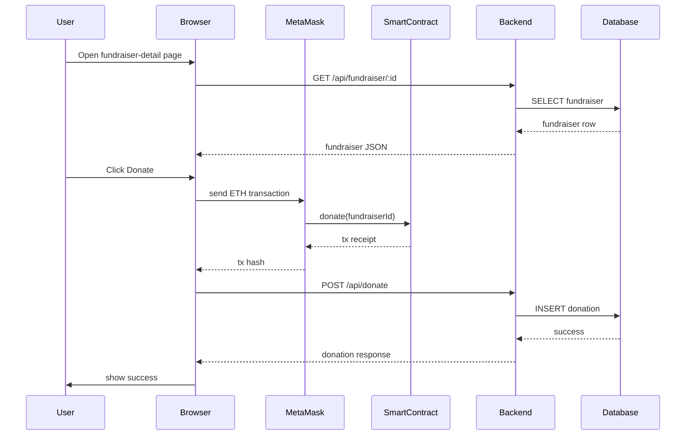
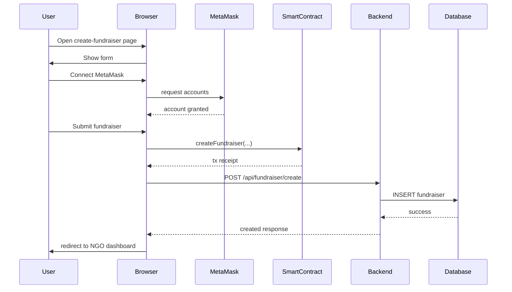

# CampusChain Engineering Audit

## 1. Complete folder structure

```text
CampusChain/
├── contract.sol
├── README.md
├── backend/
│   ├── app.js
│   ├── package.json
│   ├── server.js
│   ├── certs/
│   │   └── tidb-ca.pem
│   ├── controllers/
│   │   ├── auth.controller.js
│   │   ├── comment.controller.js
│   │   ├── donation.controller.js
│   │   ├── fundraiser.controller.js
│   │   └── profile.controller.js
│   ├── db/
│   │   └── index.js
│   ├── middlewares/
│   │   ├── auth.middleware.js
│   │   └── error.middleware.js
│   ├── routes/
│   │   ├── auth.routes.js
│   │   ├── comment.routes.js
│   │   ├── donation.routes.js
│   │   ├── fundraiser.routes.js
│   │   └── profile.routes.js
│   └── utils/
│       ├── ExpressError.js
│       └── wrapAsync.js
└── frontend/
    ├── contractConfig.js
    ├── create-fundraiser.html
    ├── create-fundraiser.js
    ├── donor-dashboard.html
    ├── donor-dashboard.js
    ├── edit-profile.html
    ├── editprofile.js
    ├── fundraiser-detail.html
    ├── fundraiser-detail.js
    ├── fundraiser.html
    ├── fundraiser.js
    ├── index.html
    ├── index.js
    ├── login.html
    ├── login.js
    ├── ngo-dashboard.html
    ├── ngo-dashboard.js
    ├── signup.html
    └── signup.js
```

---

## 2. All backend routes and endpoints

### Public
- `GET /` — backend status endpoint
- `GET /test-db` — database connectivity test
- `GET /health` — JSON health endpoint

### Authentication
- `POST /signup` — register user
- `POST /login` — authenticate user

### Fundraiser
- `GET /api/fundraisers` — list all fundraisers
- `GET /api/fundraiser/:id` — get fundraiser details
- `GET /api/raised/:id` — get total amount raised for a fundraiser
- `GET /api/my-fundraisers` — NGO-only: list logged-in NGO fundraisers
- `POST /api/fundraiser/create` — NGO-only: create fundraiser

### Donation
- `POST /api/donate` — donor-only: record donation
- `GET /api/my-donations` — donor-only: list donor donations

### Comments
- `POST /api/comment` — authenticated user adds a comment
- `GET /api/comments/:id` — get comments for a fundraiser

### Profile
- `PUT /api/profile/update` — authenticated user updates profile

---

## 3. Controllers and their responsibilities

### `backend/controllers/auth.controller.js`
- `signup`
  - Validates required fields
  - Hashes password with `bcrypt`
  - Inserts user into `users`
  - Inserts corresponding row into `donor_details` or `ngo_details`
- `login`
  - Fetches user by email
  - Verifies password
  - Issues JWT token with `{ id, role, wallet }`

### `backend/controllers/fundraiser.controller.js`
- `getAllFundraisers`
  - Returns fundraisers with aggregated donation totals
- `getFundraiserById`
  - Returns one fundraiser plus total raised
- `createFundraiser`
  - Inserts fundraiser using authenticated user wallet
- `getMyFundraisers`
  - Returns fundraisers for logged-in NGO wallet
- `getTotalRaised`
  - Returns sum of donations for fundraiser

### `backend/controllers/donation.controller.js`
- `donate`
  - Inserts donation record with donor wallet
- `myDonations`
  - Returns donor donations filtered by wallet

### `backend/controllers/comment.controller.js`
- `addComment`
  - Stores comment with fundraiser and user associations
- `getComments`
  - Returns comments with commenter names

### `backend/controllers/profile.controller.js`
- `updateProfile`
  - Updates user name and role-specific profile details

---

## 4. Middleware and how they work

### `backend/middlewares/auth.middleware.js`
- `verifyToken(req, res, next)`
  - Reads `Authorization` header
  - Removes `Bearer ` prefix if present
  - Verifies JWT with secret
  - Attaches decoded payload to `req.user`
- `requireRole(role)`
  - Checks `req.user.role`
  - Rejects request with `403` if role mismatched

### `backend/middlewares/error.middleware.js`
- Central error handler
- Sends `status` and `message`
- Logs error to console

---

## 5. JWT authentication flow

1. User submits login credentials to `POST /login`
2. Backend queries `users` by email
3. Verifies password via `bcrypt.compare`
4. Issues JWT with payload:
   - `id`
   - `role`
   - `wallet`
5. Frontend stores token in `localStorage`
6. Protected routes send token in `Authorization` header
7. Backend validates token and attaches `req.user`
8. `requireRole` enforces donor or NGO access

---

## 6. Database schema and table relationships

### Inferred tables

#### `users`
- `id`
- `name`
- `email`
- `password_hash`
- `role`
- `wallet_address`

#### `donor_details`
- `donor_id` → `users.id`
- `phone`
- `city`
- `state`
- `country`
- `donation_preference`

#### `ngo_details`
- `ngo_id` → `users.id`
- `organization_name`
- `registration_number`
- `contact_person`
- `contact_phone`
- `address`

#### `fundraisers`
- `fundraiser_id`
- `title`
- `description`
- `goal`
- `owner_wallet`
- `fundraiser_type`
- `category`
- `people_affected`

#### `donations`
- `donation_id`
- `fundraiser_id`
- `donor_address`
- `amount`
- `tx_hash`
- `donated_at`

#### `comments`
- `comment_id`
- `fundraiser_id`
- `user_id`
- `comment_text`
- `created_at`

### Relationships
- `users` → `donor_details` or `ngo_details`
- `fundraisers.owner_wallet` maps to NGO `wallet_address`
- `donations.fundraiser_id` → `fundraisers.fundraiser_id`
- `donations.donor_address` maps to donor wallet
- `comments.fundraiser_id` → `fundraisers.fundraiser_id`
- `comments.user_id` → `users.id`

> Note: relationships are application-enforced; database constraints are not visible.

---

## 7. Smart contract functions and blockchain flow

### `contract.sol`

Functions:
- `createFundraiser(string calldata _title, string calldata _description, uint256 _goal)`
  - creates fundraiser on-chain
  - assigns `owner = msg.sender`
  - emits `FundraiserCreated`
- `donate(uint256 _fundraiserId) payable`
  - requires fundraiser active
  - requires positive ETH
  - increments `raised`
  - stores donation record
  - transfers ETH to owner
  - auto-closes fundraiser when goal met
  - emits `DonationMade`
- `getDonations(uint256 _fundraiserId)`
  - returns donation list
- `closeFundraiser(uint256 _fundraiserId)`
  - owner-only
  - marks fundraiser inactive
- `getFundraiser(uint256 _fundraiserId)`
  - returns fundraiser details

### Frontend blockchain interactions
- `frontend/create-fundraiser.js`
  - connects MetaMask
  - calls `createFundraiser(...)` on contract
  - on success, calls backend `/api/fundraiser/create`
- `frontend/fundraiser-detail.js`
  - connects MetaMask
  - calls `donate(fundraiserId)` with ETH value
  - on success, calls backend `/api/donate`

### Critical mismatch
- `frontend/contractConfig.js` ABI includes functions not present in `contract.sol`
  - `addExpenseReport`, `deleteFundraiser`, `getAllFundraisers`, `getFundraisersByOwner`, `getExpenseReports`
- ABI signature for `createFundraiser` differs from `contract.sol`
- This mismatch is the largest integration risk

---

## 8. Frontend pages and API calls

### `index.html` + `index.js`
- toggles navbar links by auth state
- logout clears local storage

### `login.html` + `login.js`
- `POST /login`
- stores `token`, `role`, `wallet`
- redirects to donor or NGO dashboard

### `signup.html` + `signup.js`
- `POST /signup`
- sends `wallet_address`
- redirects to login

### `fundraiser.html` + `fundraiser.js`
- `GET /api/fundraisers`
- renders fundraiser cards
- links to details page

### `fundraiser-detail.html` + `fundraiser-detail.js`
- `GET /api/fundraiser/:id`
- `GET /api/raised/:id`
- `GET /api/comments/:id`
- `POST /api/comment`
- blockchain donation + `POST /api/donate`

### `create-fundraiser.html` + `create-fundraiser.js`
- protects NGO-only route in client
- MetaMask connect
- blockchain fundraiser creation
- backend `POST /api/fundraiser/create`

### `ngo-dashboard.html` + `ngo-dashboard.js`
- protects NGO route
- `GET /api/my-fundraisers`

### `donor-dashboard.html` + `donor-dashboard.js`
- protects donor route
- `GET /api/my-donations`

### `edit-profile.html` + `editprofile.js`
- `PUT /api/profile/update`
- no profile fetch endpoint exists

---

## 9. Donation flow sequence diagram



---

## 10. Fundraiser creation flow sequence diagram



---

## 11. Missing production-grade features

- CORS origin whitelist
- rate limiting
- input validation and sanitization
- DB migrations / schema version control
- foreign key constraints
- secure `httpOnly` cookie auth
- refresh token flow
- logging and monitoring
- OpenAPI or API docs
- contract ABI versioning checks
- wallet ownership verification
- backend contract state reconciliation
- secure password policy
- structured error responses
- tests
- error tracking
- CSRF protection
- audit fields in DB tables
- separation of deployment config
- transaction retries for failed blockchain operations

---

## 12. Code smells and architectural issues

### Backend
- comments in `app.js` imply static hosting, but static serve is disabled
- single DB connection instead of pool
- fallback hardcoded `JWT_SECRET`
- `donations` insert uses fallback `Date.now()` for `tx_hash`
- `profile` endpoint only updates, never reads profile
- backend trusts wallet address from JWT without verifying against MetaMask
- unused dependencies in `package.json`: `multer`, `csv-parse`
- no transaction boundaries or consistency checks

### Frontend
- repeated hard-coded API base URL
- inconsistent `Authorization` header use
- auth token stored in `localStorage`
- client-side role gating only
- no consistent wallet/account sync
- `fundraiser-detail.js` sends ignored fields like `payment_method`
- dashboards require explicit user action to load data
- no frontend contract read path for validation

### Blockchain
- frontend ABI mismatch with smart contract source
- contract integration is write-only from UI
- on-chain state not used as authoritative source for fundraising totals
- no contract deployment artifact in repo

---

## 13. Security issues

- JWT in `localStorage` → XSS risk
- default fallback `JWT_SECRET`
- inconsistent auth header handling
- no brute-force or rate-limit protection
- no input sanitization
- no CORS restrictions
- no CSRF defense
- backend does not enforce wallet ownership on write actions
- user role is trusted from JWT without DB revalidation
- frontend stores wallet address in `localStorage`

---

## 14. Features fully implemented

- user signup/login
- JWT auth
- donor/NGO role authorization
- NGO fundraiser creation backend
- donation recording backend
- fundraiser listing
- fundraiser detail retrieval
- comments posting and retrieval
- profile updates
- donor/NGO dashboards
- blockchain donation write path
- blockchain fundraiser creation write path

---

## 15. Features partially implemented

- blockchain integration (write path okay, read path missing)
- profile support (update only)
- wallet connection state persistence
- donation display without fundraiser metadata joins
- funds raised calculation from SQL only
- fundraising progress UI without contract validation

---

## 16. Features mentioned in README but not implemented

- expense reports storage
- DAO governance
- IPFS storage
- UPI/Razorpay hybrid payments
- on-chain verification for all reads
- expense verification dashboards
- contract event reconciliation
- decentralized governance features

---

## 17. Suggested next 20 improvements ranked by impact

1. Align frontend ABI (`frontend/contractConfig.js`) with `contract.sol`
2. Add `GET /api/profile` endpoint
3. Use DB connection pooling
4. Add DB migrations and foreign keys
5. Remove hardcoded `JWT_SECRET` fallback
6. Move auth to secure cookies
7. Add request validation with `zod`/`joi`
8. Add rate limiting
9. Add CORS origin whitelist
10. Add logging/error tracking
11. Add blockchain read verification for fundraiser totals
12. Enforce wallet ownership match between MetaMask and authenticated user
13. Remove unused packages or implement features
14. Add backend and frontend tests
15. Add audit fields on DB tables
16. Fix `Authorization` header inconsistency
17. Add contract deployment metadata/artifacts
18. Harden frontend error handling
19. Add transaction retry/explain path
20. Move frontend API base URL to config

---

## 18. Major risks

- contract ABI mismatch between frontend and `contract.sol`
- insecure token storage practice
- no DB migrations or constraints
- backend and frontend disagree on authoritative data source
- README claims features not actually implemented

> This audit file documents the full codebase state discovered in the workspace.
