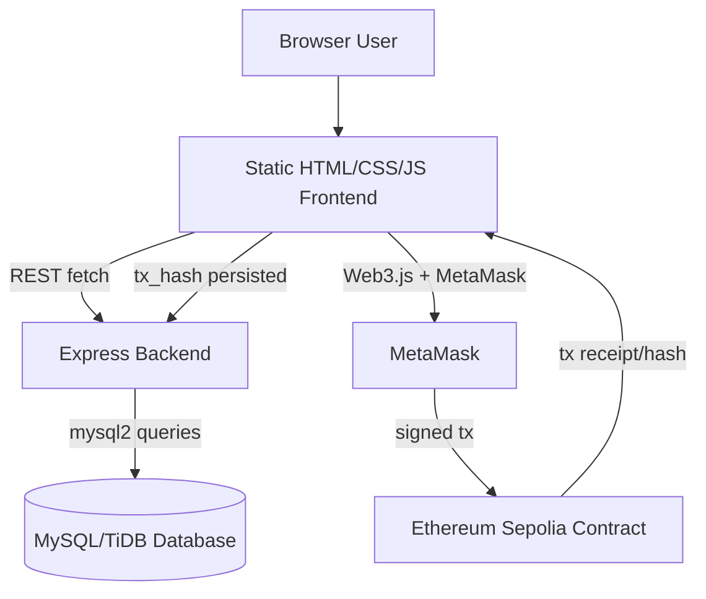
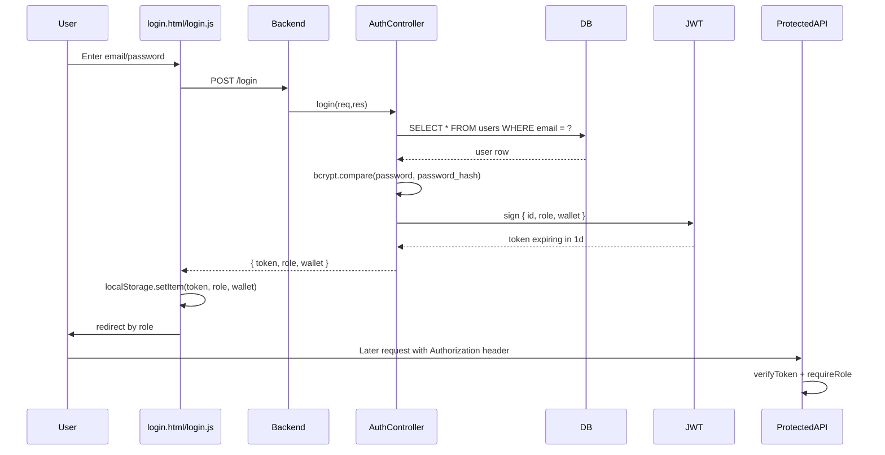
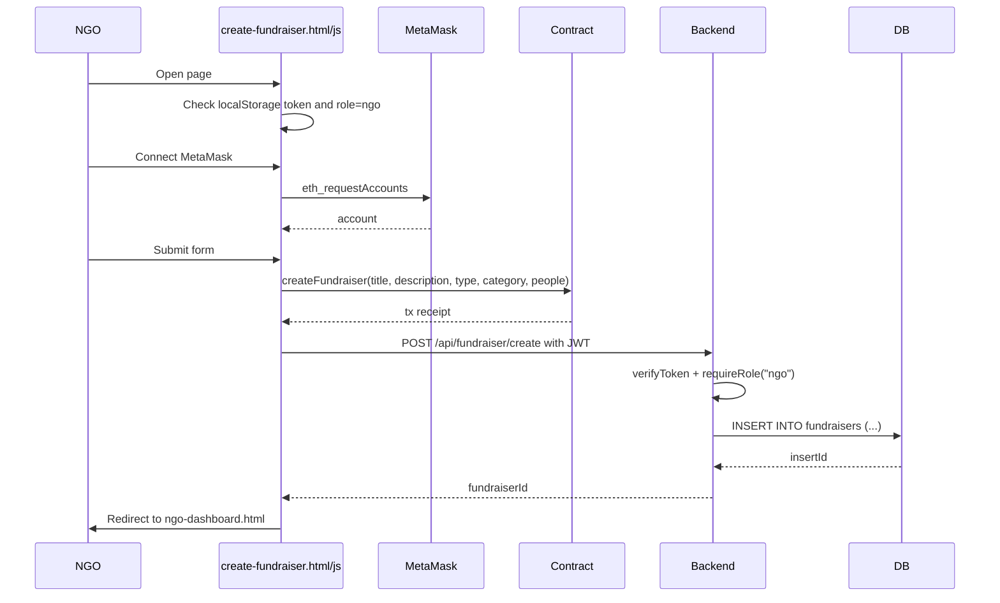
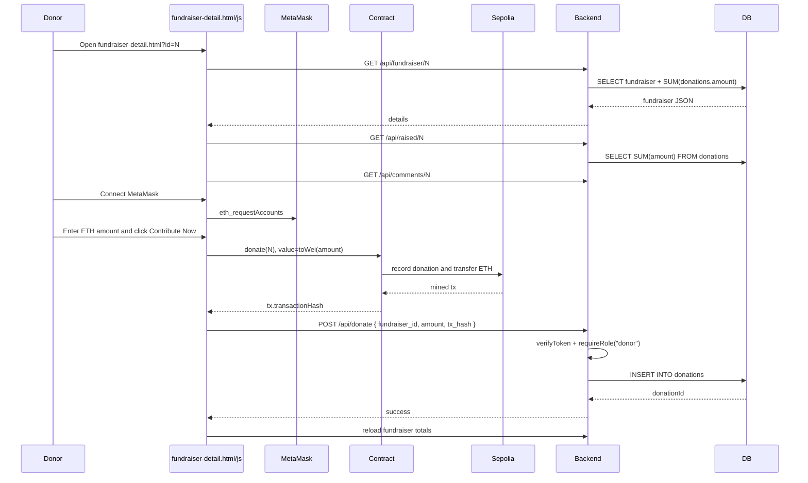
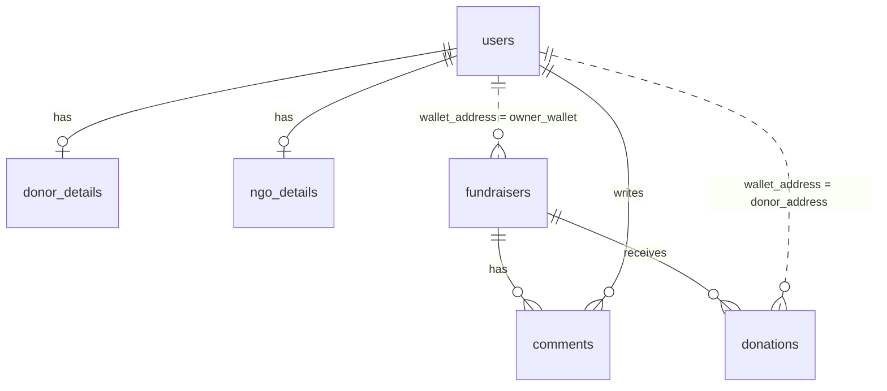
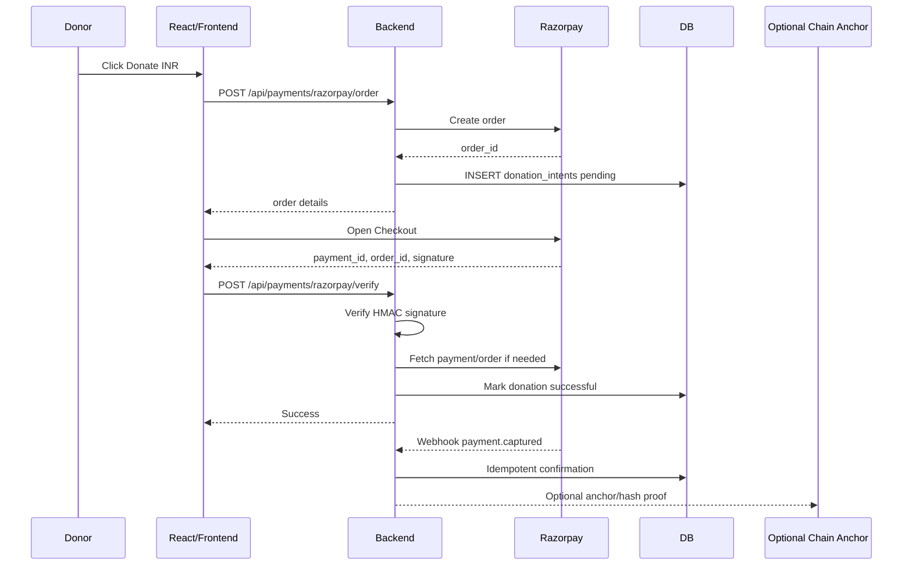
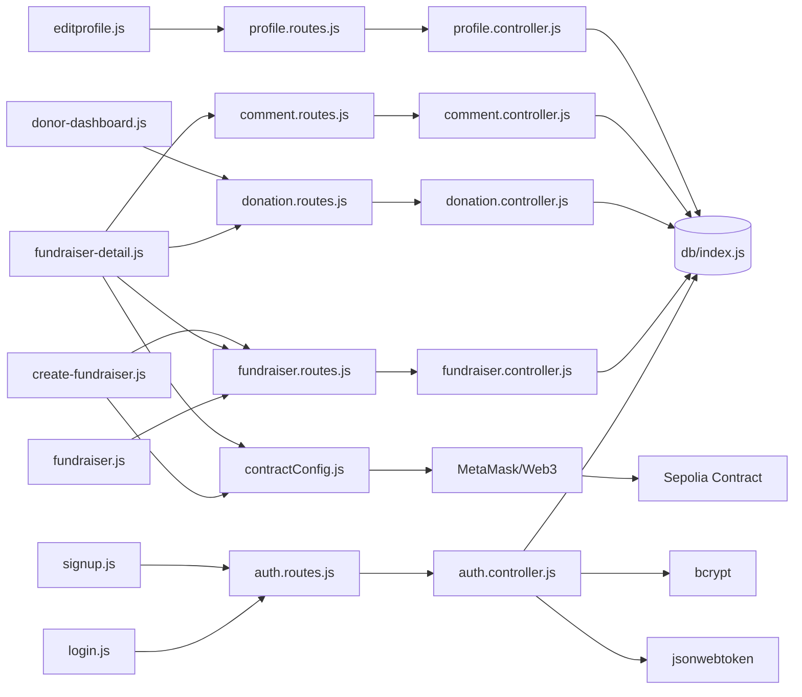

# CampusChain Engineering Architecture Report

Generated from the current workspace state.

## 1. High Level Architecture

CampusChain is a hybrid Web2/Web3 crowdfunding MVP.

### Frontend Flow

- The frontend is plain static HTML and JavaScript in `frontend/`.
- Pages call the deployed backend directly using the hard-coded base URL `https://campuschain-bqul.onrender.com`.
- Authentication state is stored in `localStorage` as `token`, `role`, and `wallet`.
- Web3 actions use MetaMask through `window.ethereum` and Web3.js loaded from CDN.
- Frontend route protection is client-side only, but backend protected APIs also enforce JWT and role checks.

### Backend Flow

- `backend/server.js` loads environment variables and starts the Express app.
- `backend/app.js` creates the Express app, enables CORS and JSON parsing, mounts all routers at root level, and installs error middleware.
- Routes delegate to controllers.
- Controllers run direct SQL queries through `mysql2`.
- `verifyToken` decodes JWTs and attaches `{ id, role, wallet }` to `req.user`.
- `requireRole` enforces donor/NGO authorization.

### Database Flow

- The database is used as the fast application index for users, profiles, fundraiser metadata, comments, and donation records.
- Fundraiser totals in the UI are calculated from SQL donations, not from the blockchain.
- Relationships are implied by code, but no schema/migration files are present in the repo.

### Blockchain Flow

- The browser, not the backend, calls the smart contract.
- Fundraiser creation is attempted on-chain first, then inserted in SQL.
- Donation is sent on-chain first, then inserted in SQL with the returned `tx_hash`.
- The backend does not currently verify that `tx_hash` exists, succeeded, matches the donor wallet, matches the fundraiser ID, or matches the donated amount.

### Important Contract Source Mismatch

The checked-in `contract.sol` does not match `frontend/contractConfig.js`.

- `contract.sol` has `createFundraiser(title, description, goal)`, `donate`, `getDonations`, `closeFundraiser`, `getFundraiser`.
- The frontend ABI expects `createFundraiser(name, description, fundraiserType, category, peopleAffected)`, plus `deleteFundraiser`, `addExpenseReport`, `getAllFundraisers`, `getFundraisersByOwner`, and report functions.
- This means the deployed contract is likely different from the Solidity file in the repo. Future contract work should start by recovering the exact deployed source/artifact.

## 2. Authentication Flow

Step-by-step:

1. `login.html` calls `loginUser()` from `frontend/login.js`.
2. `loginUser()` reads `#email` and `#password`.
3. It sends `POST /login` with JSON `{ email, password }`.
4. `backend/routes/auth.routes.js` maps `POST /login` to `login`.
5. `backend/controllers/auth.controller.js` selects the user by email.
6. Password is checked with `bcrypt.compare`.
7. JWT payload is `{ id: user.id, role: user.role, wallet: user.wallet_address }`.
8. Token is signed with `JWT_SECRET || "dev-secret-key"` and expires in 1 day.
9. Frontend stores `token`, `role`, and `wallet` in `localStorage`.
10. Donors redirect to `donor-dashboard.html`; NGOs redirect to `ngo-dashboard.html`.
11. Protected API calls pass `Authorization`.
12. `verifyToken` accepts both `Bearer <token>` and raw token because it strips `Bearer ` only if present.
13. `requireRole("donor")` or `requireRole("ngo")` checks `req.user.role`.

Security notes:

- JWT storage in `localStorage` is XSS-sensitive.
- Fallback `dev-secret-key` is dangerous in production.
- Role is trusted from JWT until token expiry.
- Wallet ownership is not cryptographically proven during login.

## 3. Fundraiser Creation Flow

Execution trace:

1. `create-fundraiser.html` loads Web3.js, `contractConfig.js`, and `create-fundraiser.js`.
2. `window.onload` checks `localStorage.token` and `localStorage.role === "ngo"`.
3. `connectWallet()` calls `ethereum.request({ method: "eth_requestAccounts" })`.
4. The contract instance is created with `new web3.eth.Contract(CONTRACT_ABI, CONTRACT_ADDRESS)`.
5. Form submit calls `createFundraiser()`.
6. Frontend validates title, description, goal, category, people, token, and connected wallet.
7. Browser sends on-chain transaction:
   `contract.methods.createFundraiser(title, description, type, category, people).send({ from: userAccount })`.
8. After blockchain success, frontend calls `POST /api/fundraiser/create`.
9. Backend route requires a valid NGO JWT.
10. Controller reads `owner_wallet` from `req.user.wallet`, not from the currently connected MetaMask account.
11. SQL inserts title, description, goal, owner_wallet, fundraiser_type, category, people_affected.

Data stored on-chain:

- In deployed ABI: name/title, description, fundraiser type, category, people affected, owner, amount raised, completion/deletion state.
- In checked-in `contract.sol`: title, description, goal, owner, raised, active.

Data stored off-chain:

- SQL fundraiser metadata: title, description, goal, owner_wallet, fundraiser_type, category, people_affected.
- SQL does not store the fundraiser creation transaction hash.
- SQL fundraiser ID may not match the on-chain fundraiser ID unless both counters are perfectly aligned.

## 4. Donation Flow

Detailed trace:

1. The Donate UI is in `fundraiser-detail.html`.
2. `fundraiser-detail.js` reads `id` from the URL.
3. `loadFundraiser()` fetches `/api/fundraiser/:id`.
4. `loadRaisedAmount()` separately fetches `/api/raised/:id`.
5. User connects MetaMask with `connectMetaMask()`.
6. User enters an ETH amount in `#ethAmount`.
7. `donateEth()` validates wallet connection, positive amount, and local token.
8. It sends:
   `contract.methods.donate(fundraiserId).send({ from: userAccount, value: web3.utils.toWei(amount, "ether") })`.
9. MetaMask prompts the donor to sign.
10. Sepolia executes the contract `donate` function.
11. The smart contract records donation and transfers ETH to fundraiser owner.
12. Browser receives `tx.transactionHash`.
13. Browser calls `POST /api/donate` with `{ fundraiser_id, amount, tx_hash, payment_method: "crypto", payment_reference: null }`.
14. Backend ignores `payment_method` and `payment_reference`.
15. Backend gets donor wallet from JWT: `req.user.wallet`.
16. Backend inserts donation row with `fundraiser_id`, `donor_address`, `amount`, `tx_hash`, and `NOW()`.

Current txHash handling:

- `tx_hash` is trusted from the browser.
- If missing, backend stores `Date.now()` as a fake transaction hash.
- There is no uniqueness check visible.
- There is no chain RPC verification.
- There is no reconciliation job from contract events.

Most important architectural risk:

The product claims blockchain transparency, but the UI totals come from SQL donation rows that the backend accepts without verifying against the blockchain transaction. A malicious client with a donor JWT can post arbitrary `amount` and `tx_hash` unless database constraints or hidden infra prevents it.

## 5. Database Analysis

No schema or migration file exists, so this is inferred from controllers.

### Tables

Inferred columns:

- `users`: `id`, `name`, `email`, `password_hash`, `role`, `wallet_address`
- `donor_details`: `donor_id`, `phone`, `city`, `state`, `country`, `donation_preference`
- `ngo_details`: `ngo_id`, `organization_name`, `registration_number`, `contact_person`, `contact_phone`, `address`
- `fundraisers`: `fundraiser_id`, `title`, `description`, `goal`, `owner_wallet`, `fundraiser_type`, `category`, `people_affected`
- `donations`: `donation_id`, `fundraiser_id`, `donor_address`, `amount`, `tx_hash`, `donated_at`
- `comments`: `comment_id`, `fundraiser_id`, `user_id`, `comment_text`, `created_at`

Recommended foreign keys:

- `donor_details.donor_id -> users.id`
- `ngo_details.ngo_id -> users.id`
- `donations.fundraiser_id -> fundraisers.fundraiser_id`
- `comments.fundraiser_id -> fundraisers.fundraiser_id`
- `comments.user_id -> users.id`

Recommended indexes:

- `users.email` unique
- `users.wallet_address`
- `users.role`
- `fundraisers.owner_wallet`
- `fundraisers.category`
- `fundraisers.fundraiser_type`
- `donations.fundraiser_id`
- `donations.donor_address`
- `donations.tx_hash` unique
- `donations.donated_at`
- `comments.fundraiser_id, comments.created_at`
- `comments.user_id`

Potential bottlenecks:

- `GET /api/fundraisers` aggregates donations with `LEFT JOIN donations` and `GROUP BY f.fundraiser_id` for every fundraiser.
- `GET /api/raised/:id` recalculates `SUM(amount)` each time.
- `GET /api/my-donations` selects only from donations and does not join fundraiser names, causing weak dashboard data.
- Single `mysql.createConnection` should become a pool for production concurrency.
- No pagination exists for fundraisers, donations, or comments.
- No cached counters/materialized totals exist.

## 6. API Inventory

| Method | Route | Controller | Auth | Purpose |
|---|---|---|---|---|
| GET | `/` | inline in `app.js` | No | Backend status text |
| GET | `/health` | inline in `app.js` | No | JSON health check |
| GET | `/test-db` | inline in `app.js` | No | Runs `SELECT 1` |
| POST | `/signup` | `signup` | No | Create user and role details row |
| POST | `/login` | `login` | No | Verify credentials and issue JWT |
| GET | `/api/fundraisers` | `getAllFundraisers` | No | List fundraisers with SQL raised total |
| GET | `/api/fundraiser/:id` | `getFundraiserById` | No | Single fundraiser with SQL raised total |
| GET | `/api/raised/:id` | `getTotalRaised` | No | Total SQL donations for fundraiser |
| GET | `/api/my-fundraisers` | `getMyFundraisers` | NGO JWT | List fundraisers owned by JWT wallet |
| POST | `/api/fundraiser/create` | `createFundraiser` | NGO JWT | Insert fundraiser metadata |
| POST | `/api/donate` | `donate` | Donor JWT | Insert donation record |
| GET | `/api/my-donations` | `myDonations` | Donor JWT | List donations by donor wallet |
| POST | `/api/comment` | `addComment` | Any JWT | Add fundraiser comment |
| GET | `/api/comments/:id` | `getComments` | No | List comments for fundraiser |
| PUT | `/api/profile/update` | `updateProfile` | Any JWT | Update common and role-specific profile fields |

## 7. Blockchain Analysis

### Checked-in `contract.sol`

Functions:

- `createFundraiser(string _title, string _description, uint256 _goal)`: creates fundraiser with owner `msg.sender`, goal in wei, raised `0`, active `true`.
- `donate(uint256 _fundraiserId) payable`: validates active fundraiser and positive value, increments raised, appends donation, transfers ETH to owner, emits events, closes if goal reached.
- `getDonations(uint256 _fundraiserId) view`: returns array of donations for the fundraiser.
- `closeFundraiser(uint256 _fundraiserId)`: owner-only manual close.
- `getFundraiser(uint256 _fundraiserId) view`: returns fundraiser fields.
- Public getters generated by Solidity: `fundraiserCount`, `fundraisers(id)`, and partial mapping getters.

Events:

- `FundraiserCreated(fundraiserId, owner, title, goal)`
- `DonationMade(fundraiserId, donor, amount)`
- `FundraiserClosed(fundraiserId)`

### Frontend ABI / Deployed Contract Shape

Additional or different functions expected by frontend:

- `createFundraiser(name, description, fundraiserType, category, peopleAffected)`
- `deleteFundraiser(id)`
- `addExpenseReport(fundraiserId, csvHash)`
- `getAllFundraisers()`
- `getFundraisersByOwner(owner)`
- `getExpenseReports(fundraiserId)`
- `expenseReports(index)`
- `expenseReportCount()`

Additional events expected:

- `DonationReceived(id, donor, amount)`
- `ExpenseReportAdded(fundraiserId, csvHash, submittedBy)`
- `FundraiserCreated(id, name, owner)`
- `FundraiserDeleted(id, owner)`

Current on-chain data:

- Fundraiser identity and owner.
- Donation amounts and donors.
- Aggregate raised amount.
- Completion/deletion/report state in deployed ABI.

Current off-chain data:

- User accounts and roles.
- Fundraiser display metadata.
- SQL donation records.
- Comments.
- Donor/NGO profile information.

## 8. Frontend Analysis

Pages:

- `index.html`: landing/home page, auth-aware nav.
- `signup.html`: user registration with optional wallet address.
- `login.html`: login and role redirect.
- `fundraiser.html`: public campaign listing.
- `fundraiser-detail.html`: campaign details, comments, MetaMask donation.
- `create-fundraiser.html`: NGO-only campaign creation.
- `ngo-dashboard.html`: NGO dashboard, manual load of owned campaigns, MetaMask connect.
- `donor-dashboard.html`: donor dashboard, manual load of donations, MetaMask connect.
- `edit-profile.html`: profile form, but inline script currently only simulates save; `editprofile.js` exists but is not loaded by the HTML.

Best React migration order:

1. `fundraiser.html` and `fundraiser-detail.html`: highest user value, reusable campaign card/detail/comment components.
2. `login.html` and `signup.html`: centralize auth state and API client.
3. `donor-dashboard.html` and `ngo-dashboard.html`: role-gated layouts and data loading.
4. `create-fundraiser.html`: integrate form state, wallet state, tx state, and backend persistence.
5. `edit-profile.html`: migrate after adding a real `GET /api/profile` endpoint.
6. `index.html`: migrate last; it is least connected to core data flow.

Frontend issues to fix during migration:

- Centralize `API_BASE`.
- Centralize auth headers.
- Replace inline `onclick` handlers with component events.
- Add route guards.
- Add wallet/account mismatch checks.
- Add typed API response handling.
- Remove reference to missing `fundraisers.js`.
- Load `editprofile.js` or replace the inline fake profile save.

## 9. Production Engineering Review

Missing validation:

- No schema validation library.
- Weak validation for role, email, wallet address, amounts, fundraiser IDs, comments, and profile fields.
- Donation amount is parsed as float, which is unsafe for money/ETH precision.

Missing rate limiting:

- Login/signup can be brute-forced.
- Donation/comment endpoints can be spammed.
- Health/test endpoints are public.

Missing logging:

- Only `console.error`.
- No request IDs, structured logs, audit logs, auth logs, or transaction logs.

Missing caching:

- Fundraiser list and raised totals recalculate from DB.
- No Redis cache for hot campaign pages.

Missing queues:

- No async transaction verification.
- No event reconciliation worker.
- No email/notification queue.
- No Razorpay webhook processing queue.

Missing monitoring:

- No metrics, uptime checks beyond `/health`, tracing, alerting, or error tracking.

Security concerns:

- JWT in localStorage.
- Hardcoded fallback JWT secret.
- CORS allows all origins.
- Backend trusts browser-supplied `tx_hash`.
- Backend trusts JWT wallet without MetaMask signature proof.
- No chain ID enforcement.
- No tx replay protection through unique `tx_hash`.
- No DB transactions around multi-table signup/profile changes.
- No password policy.
- No output sanitization for comments and fundraiser text.
- No OpenAPI contract.

## 10. Razorpay Integration Plan

### Where Razorpay Should Fit

Razorpay should be integrated in the backend as the payment authority for INR/card/UPI/netbanking donations. The browser should create/display Razorpay Checkout, but order creation, signature verification, and webhook verification must happen on the backend.

Recommended flow:

### Files Needing Changes

Backend:

- `backend/package.json`: add `razorpay`, validation library, and possibly `decimal.js`.
- `backend/app.js`: mount new payment routes and raw webhook body route if needed.
- `backend/routes/donation.routes.js` or new `backend/routes/payment.routes.js`: add Razorpay order, verify, webhook endpoints.
- `backend/controllers/donation.controller.js` or new `payment.controller.js`: implement payment intent lifecycle.
- `backend/db/index.js`: move to connection pool.
- `backend/middlewares/auth.middleware.js`: no direct Razorpay change, but use consistent bearer handling.

Frontend:

- `frontend/fundraiser-detail.js`: add payment mode selector: crypto vs Razorpay.
- `frontend/fundraiser-detail.html`: load Razorpay Checkout script and add INR input.
- Future React migration: create `DonationWidget`, `CryptoDonationForm`, `RazorpayDonationForm`.

### Backend Endpoints to Add

- `POST /api/payments/razorpay/order`
  - Auth: donor.
  - Body: `fundraiser_id`, `amount_inr`.
  - Creates Razorpay order and pending donation intent.

- `POST /api/payments/razorpay/verify`
  - Auth: donor.
  - Body: `razorpay_order_id`, `razorpay_payment_id`, `razorpay_signature`.
  - Verifies signature and records successful donation.

- `POST /api/payments/razorpay/webhook`
  - Auth: Razorpay webhook signature, not JWT.
  - Handles `payment.captured` idempotently.

- `GET /api/donations/:id/status`
  - Auth: donor or owner/admin.
  - Allows frontend to poll uncertain payment state.

### Database Changes

Add fields or split donation tables:

Option A, extend `donations`:

- `payment_method` enum: `crypto`, `razorpay`
- `currency`: `ETH`, `INR`
- `amount_wei` nullable
- `amount_inr_paise` nullable
- `status`: `pending`, `success`, `failed`, `refunded`
- `tx_hash` nullable unique
- `razorpay_order_id` nullable unique
- `razorpay_payment_id` nullable unique
- `razorpay_signature` nullable
- `verified_at`
- `metadata_json`

Option B, cleaner:

- `donations`: canonical logical donation.
- `crypto_transactions`: chain-specific fields.
- `razorpay_payments`: Razorpay-specific fields.

Recommended for production: Option B.

### Should Blockchain Be Modified?

Not required for Razorpay MVP. Razorpay is fiat/off-chain settlement, so forcing every INR donation through an ETH contract would create gas, custody, oracle, and regulatory complexity.

Better blockchain options:

- Keep existing crypto donations on-chain.
- For Razorpay donations, optionally anchor proof on-chain later:
  - Store hash of `payment_id + order_id + fundraiser_id + amount + timestamp`.
  - Emit `FiatDonationRecorded`.
  - Do this asynchronously from a backend wallet only after Razorpay verification.

### Proposed Post-Razorpay Architecture

- Backend becomes source of truth for payment state.
- Razorpay webhooks finalize fiat payments.
- Blockchain remains source of truth for crypto donations and optional public audit anchors.
- Database stores unified donation history across fiat and crypto.
- Redis caches fundraiser totals and supports idempotency locks.
- A queue worker verifies payments, reconciles webhooks, and optionally anchors fiat proofs on-chain.

## 11. Learning Report

Authentication/JWT:

- Teaches stateless API auth and role-based authorization.
- Similar systems: SaaS dashboards, admin portals, API gateways.
- Learn next: httpOnly cookies, refresh tokens, OAuth/OIDC, session invalidation.

Express REST backend:

- Teaches routing, controllers, middleware, and centralized errors.
- Similar systems: small Node.js APIs and BFF services.
- Learn next: validation, OpenAPI, service boundaries, observability.

MySQL/TiDB database:

- Teaches relational modeling, joins, aggregation, and indexes.
- Similar systems: fintech ledgers, CRM systems, marketplace apps.
- Learn next: migrations, transactions, isolation, query plans, connection pools.

Blockchain smart contract:

- Teaches immutable state, payable functions, events, and wallet-signed writes.
- Similar systems: crowdfunding dApps, public audit ledgers, escrow contracts.
- Learn next: contract deployment artifacts, event indexing, reentrancy, upgrade patterns, gas design.

MetaMask/Web3 frontend:

- Teaches wallet connection, transaction signing, receipts, and chain UX.
- Similar systems: NFT marketplaces, DAO dashboards, DeFi apps.
- Learn next: ethers.js/viem, chain switching, account mismatch handling, transaction state machines.

Hybrid Web2/Web3 architecture:

- Teaches why apps keep fast indexed metadata off-chain while anchoring trust-critical facts on-chain.
- Similar systems: Coinbase-style custody interfaces, NFT metadata systems, supply-chain audit apps.
- Learn next: event indexers, The Graph, reconciliation workers, idempotency.

Razorpay/payment architecture:

- Teaches order creation, signature verification, webhook reliability, and idempotent payment state.
- Similar systems: e-commerce checkout, donation platforms, subscription billing.
- Learn next: webhook security, refunds, settlement reconciliation, ledger accounting.

Redis:

- Would teach caching, rate limiting, sessions, queues, and locks.
- Similar systems: high-traffic APIs, job processing, real-time dashboards.
- Learn next: cache invalidation, BullMQ, distributed locks, pub/sub.

Socket.IO:

- Would teach real-time event delivery.
- Similar systems: live donation walls, chat, dashboards, auctions.
- Learn next: rooms, auth on sockets, horizontal scaling with Redis adapter.

Docker/AWS:

- Would teach reproducible deployment, environment isolation, and cloud operations.
- Similar systems: production SaaS deployments.
- Learn next: Docker Compose, ECS/App Runner, RDS, ElastiCache, CloudWatch, Secrets Manager, CI/CD.

## 12. Dependency Map

## 13. Implementation Priorities Before Major Upgrades

1. Recover and commit the exact deployed contract source/artifacts.
2. Add database migrations and constraints.
3. Add transaction hash uniqueness and blockchain verification for crypto donations.
4. Move DB access to a connection pool.
5. Add validation middleware.
6. Centralize frontend API/auth utilities.
7. Fix profile page script mismatch.
8. Add Razorpay as a backend-verified payment path.
9. Add Redis for rate limits, cache, and queue infrastructure.
10. Migrate campaign listing/detail/donation flows to React first.
