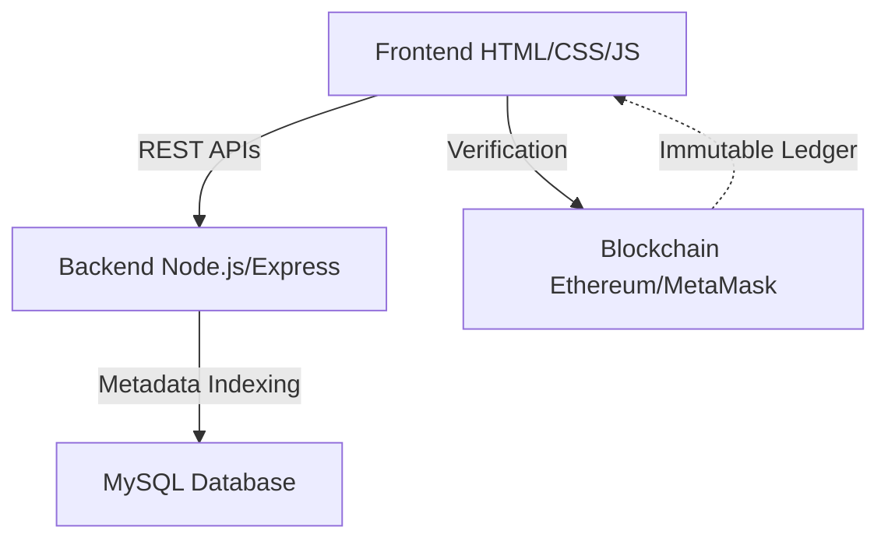

# 🎓 CampusChain

**CampusChain** is a Web3-based crowdfunding platform designed for college campuses to bring **transparency** and **trust** into student-led fundraising. It uses blockchain as a public, immutable ledger so that fundraising data can be independently verified without relying on blind trust in organizers.

---

## 🚩 Problem Statement

In college campuses, fundraising is common for:
* 🎪 Fests and cultural events
* 🤝 Student clubs and societies
* 🚑 Social causes and emergency relief

**The Core Issue:**
The problem is not payments, but a **lack of transparency**. Today:
1.  Fundraising records are maintained privately (Excel sheets, screenshots, manual reports).
2.  Donors have no independent way to verify how much money was raised.
3.  Trust is placed entirely on organizers.

This discourages participation and creates accountability concerns, even when intentions are genuine.

---

## 💡 Solution: CampusChain

CampusChain solves this problem by using blockchain as a **trust layer**:

* **On-Chain Recording:** Every fundraiser and donation is recorded on the blockchain.
* **Immutability:** Records are publicly verifiable and cannot be altered.
* **Decentralization:** No single organizer or admin can modify fundraising data behind the scenes.
* **Verification:** Donors can independently verify totals without trusting intermediaries.

> **Note:** Blockchain is used here as a *ledger of truth*, not just as a payment replacement.

---

## ❓ Why Web3? Why Not Web2?

A Web2 system (standard database) can store data, but it falls short on trust:

| Feature | Web2 (Traditional) | Web3 (CampusChain) |
| :--- | :--- | :--- |
| **Control** | Database controlled by a single authority | Decentralized ledger |
| **Integrity** | Records can be edited, deleted, or hidden | **Immutable** – records cannot be altered |
| **Transparency** | Depends on the honesty of the admin | **Trustless** – anyone can audit the data |

For this specific problem, Web3 is **essential**, not optional.

---

## 🧠 Architecture Overview

CampusChain follows a hybrid architecture to balance user experience and blockchain security.


### Architecture Components

- **MySQL**: Stores fundraiser metadata (title, description, category) for fast UI rendering  
- **Blockchain**: Acts as the immutable ledger for donations and fundraiser state  
- **Frontend**: Fetches metadata from the backend and verifies financial data directly from the blockchain  


🔗 Smart Contract
The smart contract is the core Web3 component handling:

✅ Fundraiser creation

💰 On-chain donations (payable)

🔄 Fundraiser lifecycle (active, completed, deleted)

⚓ Expense report anchoring (via hash references)

Note: MetaMask is used in this prototype to demonstrate blockchain-based transparency.

⚙️ Tech Stack
Frontend: HTML, CSS, JavaScript

Backend: Node.js, Express.js

Database: MySQL

Blockchain: Ethereum (via MetaMask)

Web3 Library: ethers.js

Smart Contracts: Solidity

## 📁 Project Structure

```text
campuschain/
├── backend/
│   ├── controllers/
│   ├── db/
│   ├── middlewares/
│   ├── routes/
│   ├── utils/
│   ├── app.js
│   └── server.js
│
├── frontend/
│   ├── contractConfig.js
│   ├── index.html
│   ├── fundraiser.html
│   ├── create-fundraiser.html
│   ├── donor-dashboard.html
│   ├── ngo-dashboard.html
│   ├── login.html
│   └── (Associated .js files)
│
└── contract.sol
```                  
🚀 Running the Project Locally
1. Backend Setup
Navigate to the backend directory and install dependencies:

```md
cd backend
npm install
npm start
```

2. Frontend Setup
Open frontend/index.html in your browser (or use Live Server).

Ensure MetaMask is installed in your browser.

Connect MetaMask to the correct network (Localhost or Testnet).

⚠️ Hackathon Note
This repository represents an initial proof-of-concept developed during the Web3 Odyssey Hackathon (Round 1).

Focus: Core idea, architecture, and smart contract design.

Scope: Full production readiness and UX optimizations are out of scope for Round 1.

Payments: MetaMask is used to clearly demonstrate on-chain transparency logic.

🔮 Future Scope

 Hybrid Payments: Integration of UPI/Razorpay with on-chain verification.

 DAO Governance: Community voting for fund release.

 Expense Verification: Dashboards for tracking utilization.

 IPFS Storage: Decentralized document storage for receipts/proofs.

🏁 Summary
CampusChain demonstrates how Web3 can solve a real campus-level problem by replacing blind trust with verifiable transparency. By using blockchain as a public ledger, the platform ensures accountability by design — something traditional Web2 systems cannot guarantee.just tell where to end
