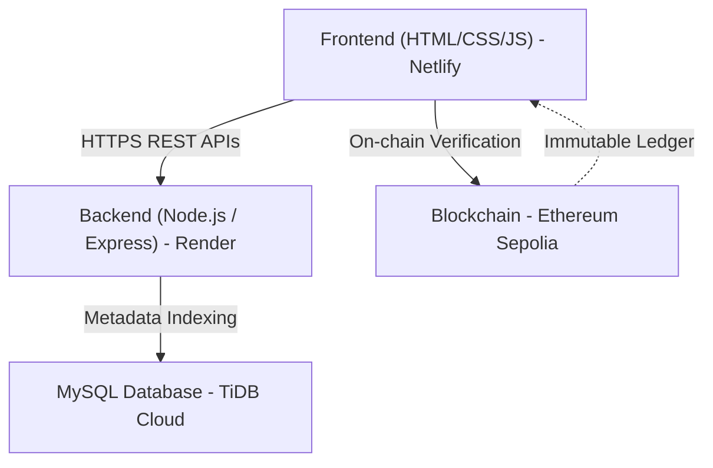

# 🎓 CampusChain

**CampusChain** is a Web3-based crowdfunding platform designed for college campuses to bring **transparency** and **trust** into student-led fundraising. It uses blockchain as a public, immutable ledger so that fundraising data can be independently verified without relying on blind trust in organizers.

---
## 🌐 Live Deployment

- **Frontend (Netlify):** https://campuschain07.netlify.app  
- **Backend API (Render):** https://campuschain-bqul.onrender.com  
- **Blockchain:** Ethereum Sepolia Testnet  
- **Smart Contract (Etherscan):**  
  https://sepolia.etherscan.io/address/0x4bd64A1f096c7eaBbeC73886CDD9Fb8c672036dc

---

## 🔐 Demo Login Credentials

**NGO**
- Email: `ngo@gmail.com`
- Password: `123`

**Donor**
- Email: `donor@gmail.com`
- Password: `123`

---

## 🚩 Problem Statement

In college campuses, fundraising is common for:
* 🎪 Fests and cultural events
* 🤝 Student clubs and societies
* 🚑 Social causes and emergency relief

**The Core Issue:**
The problem is not payments, but a **lack of transparency**. Today:
1.  Fundraising records are maintained privately (Excel sheets, screenshots, manual reports).
2.  Donors have no independent way to verify how much money was raised.
3.  Trust is placed entirely on organizers.

This discourages participation and creates accountability concerns, even when intentions are genuine.

---

## 💡 Solution: CampusChain

CampusChain solves this problem by using blockchain as a **trust layer**:

* **On-Chain Recording:** Every fundraiser and donation is recorded on the blockchain.
* **Immutability:** Records are publicly verifiable and cannot be altered.
* **Decentralization:** No single organizer or admin can modify fundraising data behind the scenes.
* **Verification:** Donors can independently verify totals without trusting intermediaries.

> **Note:** Blockchain is used here as a *ledger of truth*, not just as a payment replacement.

---

## ❓ Why Web3? Why Not Web2?

A Web2 system (standard database) can store data, but it falls short on trust:

| Feature | Web2 (Traditional) | Web3 (CampusChain) |
| :--- | :--- | :--- |
| **Control** | Database controlled by a single authority | Decentralized ledger |
| **Integrity** | Records can be edited, deleted, or hidden | **Immutable** – records cannot be altered |
| **Transparency** | Depends on the honesty of the admin | **Trustless** – anyone can audit the data |

For this specific problem, Web3 is **essential**, not optional.

---

## 🧠 Architecture Overview

CampusChain follows a hybrid Web2 + Web3 architecture to balance fast user experience with trustless transparency.

### Architecture Components

- **Frontend (Netlify)**: Static HTML/CSS/JS deployed on Netlify; fetches metadata from the backend and verifies fundraising data directly from the blockchain.  
- **Backend (Render)**: Node.js + Express APIs deployed on Render; handles authentication and business logic.  
- **Database (MySQL / TiDB Cloud)**: Stores fundraiser metadata (title, description, category, impact) for fast UI rendering.  
- **Blockchain (Ethereum Sepolia)**: Acts as the immutable ledger of truth for fundraiser creation and donations.  


🔗 Smart Contract
The smart contract is the core Web3 component handling:

✅ Fundraiser creation
💰 On-chain donations (payable)

🔄 Fundraiser lifecycle (active, completed, deleted)

⚓ Expense report anchoring (via hash references)

Note: MetaMask is used in this prototype to demonstrate blockchain-based transparency.

⚙️ Tech Stack

**Frontend:** HTML, CSS, JavaScript (deployed on Netlify)  

**Backend:** Node.js, Express.js (deployed on Render, JWT-based auth)  

**Database:** MySQL (TiDB Cloud)  

**Blockchain:** Ethereum (Sepolia Testnet)  

**Web3 Library:** ethers.js  

**Smart Contracts:** Solidity  

**Wallet:** MetaMask (transaction signing & user authentication)

## 📁 Project Structure

```text
campuschain/
├── backend/
│   ├── controllers/
│   ├── db/
│   ├── middlewares/
│   ├── routes/
│   ├── utils/
│   ├── app.js
│   └── server.js
|   └── certs
│
├── frontend/
│   ├── contractConfig.js
│   ├── index.html
│   ├── fundraiser.html
│   ├── create-fundraiser.html
│   ├── donor-dashboard.html
│   ├── ngo-dashboard.html
│   ├── login.html
│   └── (Associated .js files)
│
└── contract.sol
```                  


## 🚀 Running Locally (Optional)

### Backend
```bash
cd backend
npm install
npm start
```

⚠️ Hackathon Note (Pro Round 2)

This project represents the **final deployed MVP** developed for **Web3 Odyssey – Pro Round 2**.

- **Timeline:** January 10  
- **Demo:** Live, end-to-end user interaction showcased on **Ethereum Sepolia Testnet**  
- **Deployment:** Fully deployed frontend and backend with on-chain verification  
- **Codebase:** Complete and documented codebase updated in the original Round 1 GitHub repository  
> **Design Clarification:** MetaMask is used strictly as a transaction-signing interface to demonstrate on-chain transparency; the core value lies in the immutable public ledger, not payments.


🔮 Future Scope

 Hybrid Payments: Integration of UPI/Razorpay with on-chain verification.

 DAO Governance: Community voting for fund release.

 Expense Verification: Dashboards for tracking utilization.

 IPFS Storage: Decentralized document storage for receipts/proofs.

## 🏁 Summary

CampusChain demonstrates how Web3 can solve a real campus-level problem by replacing blind trust with verifiable transparency. By using blockchain as a public ledger, the platform ensures accountability by design — something traditional Web2 systems cannot guarantee.just tell where to end
