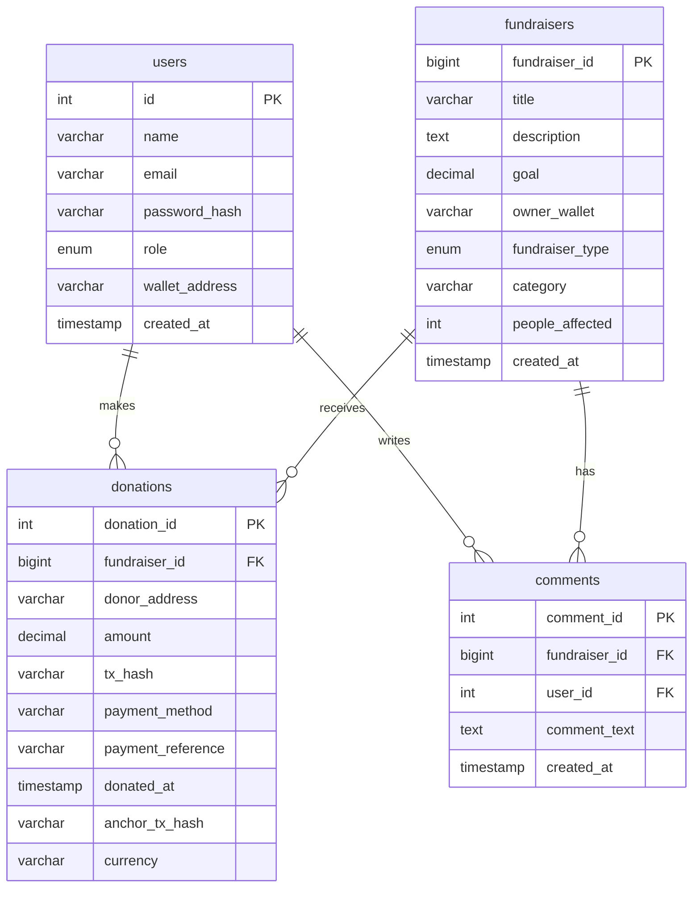

# Database Schema Documentation

CampusChain uses **TiDB Cloud** (a MySQL-compatible serverless database) as a storage and metadata caching layer.

---

## 1. Schema Overview

---

## 2. Table Definitions

### Table: `users`
Stores user profile information and credentials.
* `id` (INT, Primary Key, Auto Increment)
* `name` (VARCHAR(150), Not Null): The name of the user or NGO.
* `email` (VARCHAR(255), Not Null, Unique)
* `password_hash` (VARCHAR(255), Not Null)
* `role` (ENUM('donor', 'ngo'), Not Null)
* `wallet_address` (VARCHAR(42), Nullable): Registered Ethereum wallet address.
* `created_at` (TIMESTAMP, DEFAULT CURRENT_TIMESTAMP)

### Table: `fundraisers`
Stores fundraising campaigns created by NGOs.
* `fundraiser_id` (BIGINT, Primary Key, Auto Increment)
* `title` (VARCHAR(255), Not Null)
* `description` (TEXT, Nullable)
* `goal` (DECIMAL(30,18), Default 0): Fundraising goal stored in canonical ETH.
* `owner_wallet` (VARCHAR(42), Not Null): Wallet address to receive MetaMask funds.
* `fundraiser_type` (ENUM('public', 'private'), Default 'public')
* `category` (VARCHAR(100), Nullable)
* `people_affected` (INT, Default 0)
* `created_at` (TIMESTAMP, DEFAULT CURRENT_TIMESTAMP)

### Table: `donations`
Stores donation metadata for tracking payments.
* `donation_id` (INT, Primary Key, Auto Increment)
* `fundraiser_id` (BIGINT, Not Null): Foreign Key referencing `fundraisers.fundraiser_id`.
* `donor_address` (VARCHAR(42), Not Null): Wallet of the donor (uses `ZeroAddress` for Razorpay if unregistered).
* `amount` (DECIMAL(30,18), Not Null): Amount donated (stored as original currency unit).
* `tx_hash` (VARCHAR(100), Not Null): Blockchain hash for cryptocurrency donations, or a unique fallback hash for Razorpay orders.
* `payment_method` (VARCHAR(50), Default 'crypto'): Values: `'crypto'` (MetaMask) or `'razorpay'`.
* `payment_reference` (VARCHAR(200), Nullable): Razorpay payment ID.
* `donated_at` (TIMESTAMP, DEFAULT CURRENT_TIMESTAMP)
* `anchor_tx_hash` (VARCHAR(100), Nullable): Sepolia transaction hash proving the anchor was completed.
* `currency` (VARCHAR(10), Default 'ETH'): Values: `'ETH'` or `'INR'`.

### Table: `comments`
Stores community comments and messages of support.
* `comment_id` (INT, Primary Key, Auto Increment)
* `fundraiser_id` (BIGINT, Not Null, Cascade Delete): References `fundraisers.fundraiser_id`.
* `user_id` (INT, Not Null, Cascade Delete): References `users.id`.
* `comment_text` (TEXT, Not Null)
* `created_at` (TIMESTAMP, DEFAULT CURRENT_TIMESTAMP)
