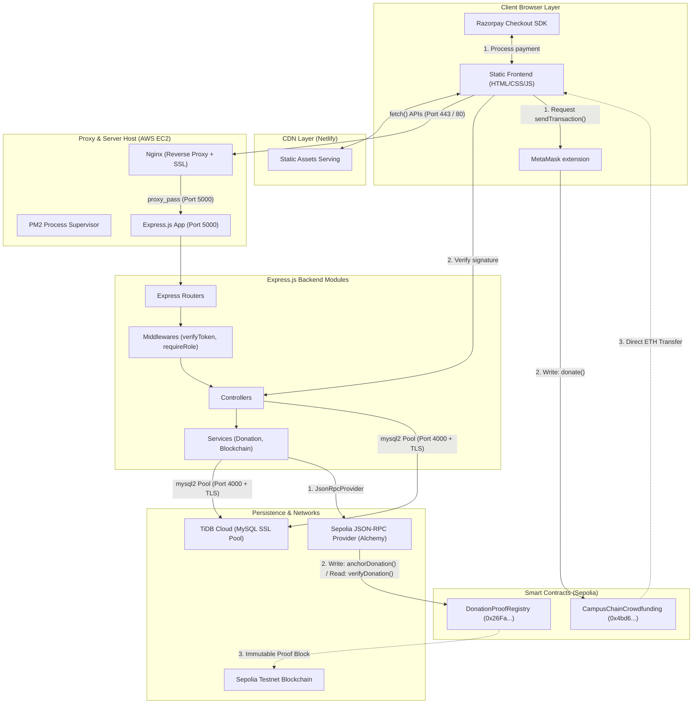
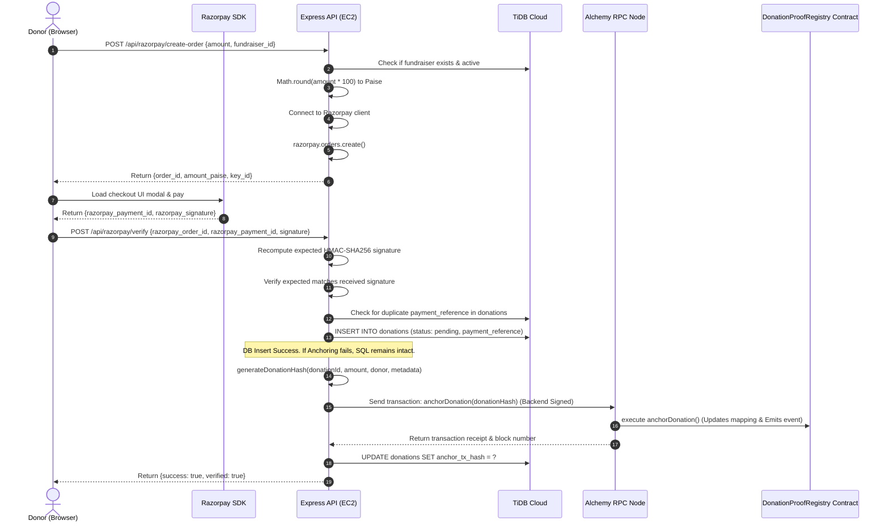

# CampusChain System Architecture & Request Flows
*Prepared by Senior Backend Engineer*

This document outlines the **actual, exact architecture** of the CampusChain system derived directly from the codebase. It details the runtime structures, deployment topology, and step-by-step request flow from user interaction to database/blockchain resolution.

---

## 🗺️ Master Architecture Diagram

This single Master Architecture Diagram captures the entire flow, showing client entry points, MetaMask, payment gateway handshakes, API routing, database updates, and off-chain smart contract anchoring.

### 1. Mermaid Structural Blueprint



### 2. ASCII Master Dataflow

```text
+-------------------------------------------------------------------------------------------------------------------+
|                                                 CLIENT BROWSER                                                    |
|  +-----------------------------+     +-----------------------------+     +-------------------------------------+  |
|  |     Static UI Webpage       |     |      MetaMask Wallet        |     |         Razorpay SDK UI             |  |
|  +--------------+--------------+     +--------------+--------------+     +------------------+------------------+  |
+-----------------|-----------------------------------|---------------------------------------|---------------------+
                  | HTTP Requests                     | Send Transactions (Web3)              | Complete Fiat Order
                  v                                   v                                       v
+-----------------|-------------------+ +-------------|-------------------+ +-----------------|---------------------+
|        NETLIFY STATIC CDN           | |     CAMPUSCHAIN CROWDFUNDING    | |       RAZORPAY GATEWAY SERVERS        |
|  (Serves HTML/CSS/JS Assets)        | |  (Solidity Smart Contract-onETH)| |  (Processes fiat bank cards/UPI)      |
+-----------------|-------------------+ +---------------------------------+ +---------------------------------------+
                  |                                                                           |
                  | API Calls (fetch)                                                         | Signature & Order Details
                  v                                                                           v
+-----------------|---------------------------------------------------------------------------|---------------------+
|        AWS EC2 INSTANCE (API HOST)                                                                                |
|                                                                                                                   |
|   +---------------------------+                                                                                   |
|   |    NGINX REVERSE PROXY    | (Handles HTTPS Port 443 / SSL let's encrypt termination)                          |
|   +-------------+-------------+                                                                                   |
|                 | proxy_pass http://localhost:5000                                                                |
|                 v                                                                                                 |
|   +-------------+-------------+                                                                                   |
|   |        PM2 RUNTIME        | (Manages & restarts the backend server process)                                   |
|   +-------------+-------------+                                                                                   |
|                 v                                                                                                 |
|   +-------------+-------------+                                                                                   |
|   |    EXPRESS.JS BACKEND     | (Main routing, authentication, business logic)                                    |
|   |                           |                                                                                   |
|   |  - Routers                | [auth.routes.js], [donation.routes.js], [payment.routes.js]                       |
|   |  - Middlewares            | [auth.middleware.js] -> (verifyToken, requireRole)                                |
|   |  - Controllers            | [auth.controller.js], [donation.controller.js], [payment.controller.js]           |
|   |  - Services               | [donation.service.js], [blockchain.service.js]                                    |
|   +--------+-------------+----+                                                                                   |
+------------|-------------|----------------------------------------------------------------------------------------+
             |             |
             | SQL Queries | RPC Provider calls (Ethers.js JsonRpcProvider)
             v             v
+------------+---+     +---+-----------------------+     +----------------------------------------------------------+
|   TIDB CLOUD   |     |    ALCHEMY RPC NODE       |     |                 SEPOLIA TESTNET NETWORK                  |
| (MySQL-compat) |     |  (JSON-RPC API Bridge)    |     |                                                          |
| - users table  |     +-----------+---------------+     |  +----------------------------------------------------+  |
| - donations    |                 |                     |  |             DONATION PROOF REGISTRY                    |  |
| - fundraisers  |                 v                     |  |       (Solidity Smart Contract deployed on Sepolia)     |  |
| - comments     |                 +-------------------->|  |   - anchorDonation(donationHash)                       |  |
|                |                                       |  |   - verifyDonation(donationHash)                       |  |
+----------------+                                       |  +----------------------------------------------------+  |
                                                         +----------------------------------------------------------+
```

---

## 🏗️ 1. Runtime Architecture (Process View)

The runtime architecture describes the active components running concurrently in memory.

1.  **Client Runtime Engine**:
    *   **Browser Sandbox**: Executes Javascript scripts (`signup.js`, `ngo-dashboard.js`, `fundraiser-detail.js`) compiled as client-side ES5/ES6.
    *   **MetaMask / Web3 Provider (`window.ethereum`)**: Injected web3 provider. The frontend queries parameters and requests user signatures for write transactions, passing raw payloads to the Sepolia blockchain network.
    *   **Razorpay SDK**: Spawns an iframe modal to securely handle credentials and UPI redirects, generating signature payloads returned via JS callbacks.
2.  **Web API Server Runtime (AWS EC2)**:
    *   **Node.js Process**: Single-threaded Event Loop running `v24.x+`.
    *   **PM2 Cluster/Fork Mode**: Standard Node.js supervisor ensuring auto-restarting of [server.js](file:///d:/CampusChain/backend/server.js) upon crashing or memory leaks.
    *   **Express Application Structure**:
        *   **Parser Middleware**: Parses incoming raw bytes into JSON payloads (`express.json()`) or static folder resolutions.
        *   **CORS Engine**: Injects header fields (`Access-Control-Allow-Origin`) onto responses.
        *   **Route Registers**: Maps HTTP verbs + URLs to specific pipeline sequences.
        *   **Middleware Enforcers**: Validates JWT signatures and inspects payload scopes.
        *   **Controllers & Services**: Execute queries and instantiate external RPC connections.
3.  **Database Connection Pool (TiDB Cloud)**:
    *   Maintains a warm pool of up to 10 persistent TCP connections over TLS. The pool distributes incoming queries asynchronously, queueing excess tasks until a connection becomes idle.
4.  **Ethers.js RPC Provider Channel**:
    *   Establishes a stateless connection to Alchemy's Sepolia RPC nodes, allowing the backend to encode contract transaction payloads, sign them using the private key, and poll block receipts.

---

## 🚀 2. Deployment Architecture (Infrastructure View)

The deployment architecture defines the structural physical hosting locations, reverse proxies, and infrastructure boundaries.

```text
+-------------------+      HTTPS Requests (443)       +------------------------------------+
|   Netlify CDN     |-------------------------------->|        AWS EC2 (Linux Host)        |
|  (Static Assets)  |                                 |  +------------------------------+  |
+-------------------+                                 |  |            Nginx             |  |
                                                      |  |  (Reverse Proxy / SSL Term)  |  |
                                                      |  +--------------+---------------+  |
                                                      |                 | proxy_pass       |
                                                      |                 v                  |
                                                      |  +------------------------------+  |
                                                      |  |       Express (Port 5000)    |  |
                                                      |  |         (Managed by PM2)     |  |
                                                      |  +------------------------------+  |
                                                      +------------------+-----------------+
                                                                         |
                                                                  TLS (Port 4000)
                                                                         v
                                                      +------------------------------------+
                                                      |             TiDB Cloud             |
                                                      |        (Serverless Distributed)    |
                                                      +------------------------------------+
```

1.  **Frontend: Netlify CDN**:
    *   *Why it exists:* Netlify serves the static index pages globally. Serving these files from a global edge network reduces latency, offloads rendering to the browser, and minimizes CPU usage on the EC2 host.
2.  **Proxy Layer: Nginx (Reverse Proxy on EC2)**:
    *   *Why it exists:* Express is not optimized to handle raw SSL handshakes or direct public traffic (port 80/443). Nginx acts as a high-performance entry point, handling Let's Encrypt SSL/TLS termination and forwarding traffic to Express on port 5000.
3.  **Process Manager: PM2 on EC2**:
    *   *Why it exists:* A simple `node server.js` command terminates if an unhandled exception escapes. PM2 supervises the process, handles log rotation, and restarts the app if it crashes.
4.  **Database Layer: TiDB Cloud Serverless**:
    *   *Why it exists:* A serverless distributed MySQL database that automatically scales compute and storage, providing ACID guarantees and high availability without manual database maintenance.

---

## 🔄 3. Request Flow (Step-by-Step Scenario)

### Detailed Scenario: Recording and Verification of a Donation (Razorpay Flow)

Below is the execution sequence when a donor completes a Razorpay payment and verifies their transaction.



---

## 📊 4. API Endpoint Categorization & Resource Routing

The tables below classify backend endpoints according to their database and blockchain interactions.

### A. SQL-Only Operations
*These endpoints perform CRUD operations on the TiDB database and do not interact with the blockchain network.*

| Endpoint | Method | Controller/Function | Description |
| :--- | :--- | :--- | :--- |
| `/signup` | `POST` | `signup` in [auth.controller.js](file:///d:/CampusChain/backend/controllers/auth.controller.js#L12) | Registers users and hashes passwords. |
| `/login` | `POST` | `login` in [auth.controller.js](file:///d:/CampusChain/backend/controllers/auth.controller.js#L58) | Validates credentials and returns JWT. |
| `/api/profile` | `GET` | `getProfile` in [profile.controller.js](file:///d:/CampusChain/backend/controllers/profile.controller.js#L4) | Joins `users` with profile details. |
| `/api/profile/update`| `PUT` | `updateProfile` in [profile.controller.js](file:///d:/CampusChain/backend/controllers/profile.controller.js#L40) | Modifies profile fields. |
| `/api/comment` | `POST` | `addComment` in [comment.controller.js](file:///d:/CampusChain/backend/controllers/comment.controller.js#L5) | Appends a comment to a fundraiser. |
| `/api/comments/:id` | `GET` | `getComments` in [comment.controller.js](file:///d:/CampusChain/backend/controllers/comment.controller.js#L30) | Fetches comments for a fundraiser. |
| `/api/comments/:commentId` | `DELETE`| `deleteComment` in [comment.controller.js](file:///d:/CampusChain/backend/controllers/comment.controller.js#L53) | Removes a comment (authorized for campaign owners). |
| `/api/fundraiser/:id/status`| `PUT` | `updateFundraiserStatus` in [fundraiser.controller.js](file:///d:/CampusChain/backend/controllers/fundraiser.controller.js#L125) | Sets status to `'active'` or `'closed'`. |
| `/api/fundraiser/:id/description`| `PUT` | `updateFundraiserDescription` in [fundraiser.controller.js](file:///d:/CampusChain/backend/controllers/fundraiser.controller.js#L151) | Updates campaign descriptions. |

### B. Hybrid Operations (SQL + Blockchain)
*These endpoints query/write to TiDB and anchor cryptographic proofs or verify them on Sepolia via Ethers.js RPC calls.*

| Endpoint | Method | Controller/Function | Persistence Logic |
| :--- | :--- | :--- | :--- |
| `/api/donate` (MetaMask) | `POST` | `donate` in [donation.controller.js](file:///d:/CampusChain/backend/controllers/donation.controller.js#L7) | **1.** Inserts transaction hash (`tx_hash`) and donation record in TiDB.<br>**2.** Computes deterministic donation hash.<br>**3.** Calls contract [anchorDonation](file:///d:/CampusChain/backend/services/blockchain.service.js#L176) and updates record with Sepolia hash. |
| `/api/razorpay/verify` | `POST` | `verifyPayment` in [payment.controller.js](file:///d:/CampusChain/backend/controllers/payment.controller.js#L58) | **1.** Verifies payment signature.<br>**2.** Inserts donation metadata in TiDB.<br>**3.** Generates proof hash, calls [anchorDonation](file:///d:/CampusChain/backend/services/blockchain.service.js#L176), and updates record with anchoring transaction hash. |
| `/api/donation/:donationId/verify` | `GET` | `verifyDonationProof` in [donationVerification.controller.js](file:///d:/CampusChain/backend/controllers/donationVerification.controller.js#L8) | **1.** Fetches donation metadata from TiDB.<br>**2.** Recomputes deterministic hash.<br>**3.** Performs a read-only View call ([verifyDonation](file:///d:/CampusChain/backend/services/blockchain.service.js#L159)) to check proof status on-chain. |

---

## 🔎 5. Inconsistencies: Documentation vs. Actual Implementation

During the codebase analysis, several inconsistencies between the codebase and the documentation were identified.

### 1. The Redundant Static Serving Code
*   **Actual Code:** [app.js](file:///d:/CampusChain/backend/app.js#L51) configures static directories:
    ```javascript
    app.use(express.static(path.join(__dirname, "../frontend")));
    ```
*   **Documentation:** [DEPLOYMENT.md](file:///d:/CampusChain/docs/DEPLOYMENT.md#L9) states that the frontend is deployed and served via **Netlify**, while the backend is deployed on EC2.
*   **Implication:** The code to serve static assets from the Express backend is redundant. The Netlify static deployment handles UI file delivery, and the backend routes serve strictly as a REST API.

### 2. ABI & Smart Contract Inconsistencies (`contract.sol`)
*   **Actual Code:** [contractConfig.js](file:///d:/CampusChain/frontend/contractConfig.js#L4) defines a large Solidity ABI containing expense reports and campaign deletion methods:
    *   `addExpenseReport(uint256 _fundraiserId, string _csvHash)`
    *   `deleteFundraiser(uint256 _id)`
    *   `getAllFundraisers()`, `getFundraisersByOwner()`, `getExpenseReports()`
*   **Repository Solidity File:** [contract.sol](file:///d:/CampusChain/contract.sol) contains a minimal smart contract:
    *   Methods: `createFundraiser`, `donate`, `getDonations`, `closeFundraiser`, `getFundraiser`.
    *   *No* expense report structs, *no* deletion functions, and *no* list getters.
*   **Implication:** The `contract.sol` file in the root directory is simplified or outdated. It does not match the deployed smart contract ABI at `0x4bd64A1f096c7eaBbeC73886CDD9Fb8c672036dc` that the frontend interacts with.

### 3. Dead Backend Service File
*   **Actual Code:** [donationVerification.service.js](file:///d:/CampusChain/backend/services/donationVerification.service.js) exists and contains `verifyDonationProofById`, but it only throws an error:
    ```javascript
    throw new ExpressError(500, "verifyDonationProofById not fully implemented yet");
    ```
*   **Controller Usage:** [donationVerification.controller.js](file:///d:/CampusChain/backend/controllers/donationVerification.controller.js#L3) bypasses the service file, importing `verifyDonation` and `generateDonationHash` directly from the core [blockchain.service.js](file:///d:/CampusChain/backend/services/blockchain.service.js) file.
*   **Implication:** The verification service file is incomplete dead code, violating the layered structure pattern outlined in the system architecture docs.

### 4. Hardcoded Exchange Rates in SQL
*   **Actual Code:** In [fundraiser.controller.js](file:///d:/CampusChain/backend/controllers/fundraiser.controller.js#L11), conversions are handled via hardcoded math in database queries:
    ```sql
    IFNULL(SUM(CASE WHEN d.currency = 'INR' THEN d.amount / 300000.0 ELSE d.amount END), 0) AS raised
    ```
*   **Implication:** Hardcoding a static exchange rate (1 ETH = 300,000 INR) directly in SQL queries is highly fragile. Any fluctuations in market prices will make these calculations inaccurate unless the code is updated and redeployed.

### 5. Config Key Discrepancies
*   **Actual Code:** [blockchain.service.js](file:///d:/CampusChain/backend/services/blockchain.service.js#L10) reads keys `PROOF_REGISTRY_ADDRESS` and `RPC_URL`.
*   **Env Example:** [.env.example](file:///d:/CampusChain/backend/.env.example#L26) defines `CONTRACT_ADDRESS` and `INFURA_URL`.
*   **Implication:** The configuration key names differ between the example environment template and the actual service file implementation.
