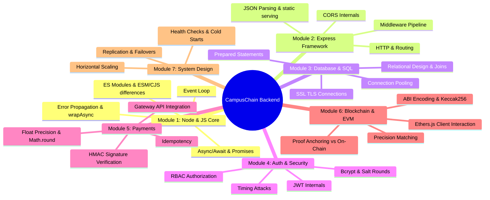

# CampusChain Backend Interview Defense Syllabus
*Prepared by Senior Backend Engineer*

This document serves as your comprehensive FAANG/Trilogy-level interview preparation syllabus, designed specifically to help you defend the **CampusChain** backend architecture.

Rather than summarizing what the project does, this syllabus breaks down every direct and indirect engineering concept, detailing **why they exist**, **how they are implemented in your code**, **critical trade-offs (Why X vs Y)**, **security vulnerabilities**, **system design considerations**, and **expected follow-up questions**.

---

## 🗺️ Syllabus Map & Concept Catalog



---

## Module 1: Node.js & JavaScript Fundamentals

### 1. The Event Loop & Single-Threaded I/O
*   **Why it exists:** Node.js executes JavaScript code in a single-threaded event loop. This design allows it to handle high concurrency with low overhead by offloading blocking operations (I/O, database queries, crypto, network requests) to the operating system or Node's internal worker pool (libuv).
*   **Where it appears:** It governs the entire execution of your server. When `db.promise().query()` or `ethers.JsonRpcProvider` calls are made, they do not block the execution of other incoming requests; instead, they place callbacks on the event loop queue once they resolve.
*   **Prerequisites:** JavaScript execution model, stack vs heap.
*   **Difficulty:** Medium
*   **Interview Importance:** 9/10
*   **Classification:** MUST KNOW
*   **Expected Follow-up Questions:**
    1. *If Node.js is single-threaded, how does it handle 10,000 database connections concurrently?*
    2. *What happens if you execute a long-running CPU-bound calculation (e.g., recursive Fibonacci) inside `auth.controller.js`? How does this impact other users trying to log in?*
    3. *What is `libuv`? How does it differ from the Javascript engine (V8)?*

### 2. Promises, Asynchronous Flow Control, & Error Handling
*   **Why it exists:** Modern JavaScript uses Promises and `async/await` syntax to write asynchronous code that reads sequentially, avoiding the deeply nested structure known as "callback hell".
*   **Where it appears:** Used in database queries (`await db.promise().query()`) in [auth.controller.js](file:///d:/CampusChain/backend/controllers/auth.controller.js#L27-L29), blockchain transactions (`await tx.wait()`) in [blockchain.service.js](file:///d:/CampusChain/backend/services/blockchain.service.js#L197), and payment processing in [payment.controller.js](file:///d:/CampusChain/backend/controllers/payment.controller.js#L118-L126).
*   **Prerequisites:** Callback functions, Promise lifecycle states (Pending, Fulfilled, Rejected).
*   **Difficulty:** Easy
*   **Interview Importance:** 8/10
*   **Classification:** MUST KNOW
*   **Expected Follow-up Questions:**
    1. *What is the difference between a microtask queue and a macrotask queue in Node.js? Which queue does a resolved Promise callback enter?*
    2. *What happens when an async database call throws an error inside an Express handler without a try-catch block?*

### 3. Asynchronous Error Propagation (wrapAsync)
*   **Why it exists:** In Express v4 (and some versions of v5), unhandled promise rejections inside async route handlers are not automatically caught by Express's global error middleware. They result in "UnhandledPromiseRejectionWarning" and can leave connections open or crash the process. A wrapper helper catch handler intercepts these rejections and forwards them using `next(err)`.
*   **Where it appears:**
    *   Helper function: [wrapAsync.js](file:///d:/CampusChain/backend/utils/wrapAsync.js)
    *   Applied in routes: [auth.routes.js](file:///d:/CampusChain/backend/routes/auth.routes.js#L16-L17)
*   **Prerequisites:** Higher-Order Functions, Express Error Middleware pipeline.
*   **Difficulty:** Medium
*   **Interview Importance:** 7/10
*   **Classification:** MUST KNOW
*   **Expected Follow-up Questions:**
    1. *Explain how `wrapAsync` works as a higher-order function. Why does it return a new function signature `(req, res, next)`?*
    2. *In Express v5, is this custom `wrapAsync` wrapper still strictly necessary? (Answer: Express v5 has built-in support for catching rejected promises returned by handlers, but keeping it ensures backwards compatibility and explicit control).*

### 4. ES Modules (ESM) vs CommonJS (CJS) & Simulating `__dirname`
*   **Why it exists:** Node.js historically used CommonJS (`require()`), but modern environments use ES Modules (`import`/`export`). In ESM, global variables like `__dirname` and `__filename` are not defined, forcing developers to derive them using the module metadata URL.
*   **Where it appears:**
    *   Package type: `"type": "module"` in [package.json](file:///d:/CampusChain/backend/package.json#L5)
    *   `__dirname` recreation: [app.js](file:///d:/CampusChain/backend/app.js#L44-L46) and [db/index.js](file:///d:/CampusChain/backend/db/index.js#L6-L7)
*   **Prerequisites:** Module scopes, file URLs.
*   **Difficulty:** Easy
*   **Interview Importance:** 6/10
*   **Classification:** GOOD TO KNOW
*   **Expected Follow-up Questions:**
    1. *Why are ES Modules parsed statically, whereas CommonJS modules are loaded dynamically at runtime? What are the tree-shaking implications of this?*
    2. *How would you resolve a module path dynamically if `import` statements must be static? (Answer: Dynamic `import()` function).*

---

## Module 2: Express.js & REST API Architecture

### 1. Middleware Architecture
*   **Why it exists:** Express uses a pipeline of middleware functions to inspect, modify, or terminate HTTP requests sequentially before they reach the controller logic.
*   **Where it appears:**
    *   Global middlewares (CORS, JSON parser): [app.js](file:///d:/CampusChain/backend/app.js#L40-L42)
    *   Route specific validation: [donationVerification.routes.js](file:///d:/CampusChain/backend/routes/donationVerification.routes.js#L11-L16)
    *   Global error handler: [error.middleware.js](file:///d:/CampusChain/backend/middlewares/error.middleware.js)
*   **Prerequisites:** Chain of Responsibility design pattern.
*   **Difficulty:** Easy
*   **Interview Importance:** 8/10
*   **Classification:** MUST KNOW
*   **Expected Follow-up Questions:**
    1. *What happens if a middleware does not call `next()` or send a response (e.g., `res.send()`)?*
    2. *How does Express distinguish between a standard routing middleware and an error-handling middleware? (Answer: Error middlewares have exactly 4 arguments: `(err, req, res, next)`).*

### 2. CORS (Cross-Origin Resource Sharing) Internals
*   **Why it exists:** Browsers enforce the Same-Origin Policy, blockading scripts running on domain A from making fetch requests to domain B unless domain B explicitly authorizes A via HTTP headers.
*   **Where it appears:** Enabled globally via `app.use(cors())` in [app.js](file:///d:/CampusChain/backend/app.js#L40).
*   **Prerequisites:** HTTP Request/Response structure, Origin headers.
*   **Difficulty:** Medium
*   **Interview Importance:** 8/10
*   **Classification:** MUST KNOW
*   **Expected Follow-up Questions:**
    1. *What is a CORS preflight request (`OPTIONS`)? When does a browser trigger it?*
    2. *Why is `cors()` middleware a client-side security feature rather than a server-side defense? Does it protect your backend if an attacker invokes your API using `curl`?*

---

## Module 3: Database Design, SQL, & Pooling

### 1. Database Connection Pooling
*   **Why it exists:** Establishing a physical TCP connection to a database is resource-heavy (requires handshakes, SSL negotiations). A pool maintains a warm set of reusable connections, eliminating connection-creation latency.
*   **Where it appears:** Configured in [db/index.js](file:///d:/CampusChain/backend/db/index.js#L15-L34) using `mysql.createPool`.
*   **Prerequisites:** Thread pools, TCP handshakes.
*   **Difficulty:** Hard
*   **Interview Importance:** 9/10
*   **Classification:** MUST KNOW
*   **Expected Follow-up Questions:**
    1. *What is the impact of setting `connectionLimit: 10` on system throughput under high concurrent load? How do you calculate the optimal pool size?*
    2. *What do the properties `idleTimeout` and `keepAliveInitialDelay` accomplish in your connection pool settings?*
    3. *What is the difference between client-side pooling and server-side pooling (e.g., using pgBouncer in PostgreSQL)?*

### 2. SQL Prepared Statements & SQL Injection Prevention
*   **Why it exists:** SQL Injection occurs when user input is concatenated directly into SQL query strings. Prepared statements send the query template and values separately. The database compiles the template first and treats the values strictly as data, never executing them as SQL code.
*   **Where it appears:** Throughout the codebase (e.g., query inputs parameterized using `?` in [auth.controller.js](file:///d:/CampusChain/backend/controllers/auth.controller.js#L27-L29)).
*   **Prerequisites:** Lexical analysis, database compiler.
*   **Difficulty:** Easy
*   **Interview Importance:** 10/10
*   **Classification:** MUST KNOW
*   **Expected Follow-up Questions:**
    1. *Is query parameterization done on the client side (in Node.js) or the database server?*
    2. *Can you use prepared statements for table names or column names (e.g., `SELECT * FROM ?`)? Why or why not?*

### 3. Financial Precision & Database Datatypes
*   **Why it exists:** Floating-point representations (IEEE 754) used in programming languages introduce rounding errors (e.g., `0.1 + 0.2 !== 0.3`). This is unacceptable for financial balances. Database types like `DECIMAL` store numbers as base-10 strings, ensuring exact precision.
*   **Where it appears:** Schema design in [DATABASE.md](file:///d:/CampusChain/docs/DATABASE.md#L79) utilizing `DECIMAL(30, 18)` to store both Ethereum wei values and INR currencies.
*   **Prerequisites:** Binary floating-point representation, decimal representation.
*   **Difficulty:** Medium
*   **Interview Importance:** 9/10
*   **Classification:** MUST KNOW
*   **Expected Follow-up Questions:**
    1. *Why did you select `DECIMAL(30,18)` specifically? What do the scale and precision parameters signify here? (Answer: Ethereum's smallest unit is Wei: $10^{-18}$ ETH, requiring 18 decimal places of scale).*
    2. *If JavaScript's `Number` type is standard 64-bit float, how does the backend safely manipulate values retrieved from `DECIMAL` columns without losing precision? (Answer: It reads them as strings, then utilizes libraries like `ethers.BigNumber` or JS native `BigInt`).*

---

## Module 4: Authentication, Cryptography, & Security

### 1. Password Hashing (Bcrypt & Salt Rounds)
*   **Why it exists:** Passwords must never be stored in plain text. Hashing is a one-way mathematical function. Bcrypt applies a hash function (Blowfish-based key derivation) repeatedly along with a random string called a "salt". The salt prevents rainbow table attacks, and the iterative workload (cost factor) slows down brute-force attacks.
*   **Where it appears:** [auth.controller.js](file:///d:/CampusChain/backend/controllers/auth.controller.js#L19) using `bcrypt.hash(password, 10)`.
*   **Prerequisites:** One-way hash functions, brute force attacks, rainbow tables.
*   **Difficulty:** Medium
*   **Interview Importance:** 9/10
*   **Classification:** MUST KNOW
*   **Expected Follow-up Questions:**
    1. *Why does Bcrypt's cost factor grow exponentially? What is the impact of changing the salt rounds from 10 to 14?*
    2. *How does `bcrypt.compare` verify a password when the database only stores the hashed string? (Answer: The salt is embedded inside the stored hash string; bcrypt extracts it, hashes the user-entered password with that salt and the same cost factor, then compares the output).*

### 2. JSON Web Token (JWT) Internals & Stateless Auth
*   **Why it exists:** Stateless authentication allows the backend to verify the identity of a client without checking a database session table for every request, reducing I/O and letting servers scale horizontally.
*   **Where it appears:**
    *   Sign token: [auth.controller.js](file:///d:/CampusChain/backend/controllers/auth.controller.js#L88)
    *   Verify token middleware: [auth.middleware.js](file:///d:/CampusChain/backend/middlewares/auth.middleware.js#L10-L34)
*   **Prerequisites:** Cryptographic signatures (HMAC vs RSA), Base64 encoding.
*   **Difficulty:** Medium
*   **Interview Importance:** 10/10
*   **Classification:** MUST KNOW
*   **Expected Follow-up Questions:**
    1. *What are the three parts of a JWT? What does the signature prove?*
    2. *If JWT is stateless, how do you handle token revocation (e.g., if a user logs out or their token is compromised)?*
    3. *Compare JWTs against stateful Sessions stored in Redis. What are the CPU, memory, and database tradeoffs?*

### 3. Role-Based Access Control (RBAC) Middleware
*   **Why it exists:** Restricting API endpoints to authorized users prevents horizontal privilege escalation (e.g., users accessing administrator resources).
*   **Where it appears:** [auth.middleware.js](file:///d:/CampusChain/backend/middlewares/auth.middleware.js#L37-L49) containing the `requireRole(role)` higher-order check.
*   **Prerequisites:** Authentication vs Authorization concepts.
*   **Difficulty:** Easy
*   **Interview Importance:** 8/10
*   **Classification:** MUST KNOW
*   **Expected Follow-up Questions:**
    1. *What is the difference between RBAC (Role-Based) and ABAC (Attribute-Based) access control?*
    2. *How is role information protected from modification by the client? (Answer: It is part of the JWT payload, signed by the server's secret key).*

---

## Module 5: Payment Gateway Integration & Financial Security

### 1. The Gateway Handshake (Orders, Verification, Webhooks)
*   **Why it exists:** Direct client-side calls to charge users can be bypassed or manipulated. A secure payment gateway flow forces a server-side handshake:
    1. The backend requests an official order.
    2. The client processes the checkout on the gateway UI.
    3. The backend receives a signature from the client and verifies it with the secret.
*   **Where it appears:**
    *   Create order: [payment.controller.js](file:///d:/CampusChain/backend/controllers/payment.controller.js#L165-L214)
    *   Verify signature: [payment.controller.js](file:///d:/CampusChain/backend/controllers/payment.controller.js#L58-L163)
*   **Prerequisites:** Cryptographic signatures, HTTP client/server architecture.
*   **Difficulty:** Hard
*   **Interview Importance:** 9/10
*   **Classification:** MUST KNOW
*   **Expected Follow-up Questions:**
    1. *Why does Razorpay require order creation on the backend rather than allowing the frontend to call the Razorpay API directly?*
    2. *If the user completes their payment but closes the browser before the frontend can send the transaction info to `/api/verify-payment`, the donation is not recorded. How would you solve this using webhooks?*

### 2. Cryptographic Verification & Preventing Replay Attacks
*   **Why it exists:** Without verifying signatures, an attacker could send a fake request to `/api/verify-payment` claiming they successfully donated, getting credit without spending money.
*   **Where it appears:** Re-creation of Razorpay signature using HMAC-SHA256: [payment.controller.js](file:///d:/CampusChain/backend/controllers/payment.controller.js#L33-L56).
*   **Prerequisites:** HMAC (Hash-based Message Authentication Code).
*   **Difficulty:** Hard
*   **Interview Importance:** 9/10
*   **Classification:** MUST KNOW
*   **Expected Follow-up Questions:**
    1. *Explain how HMAC-SHA256 works. Why is a simple SHA256 hash of the payload not secure enough? (Answer: HMAC uses a shared secret, preventing length extension attacks).*
    2. *Is there a timing attack vulnerability in your code at `expected !== razorpay_signature`? How do you fix it? (Answer: Yes; string `===` comparison exits early. Fix by using `crypto.timingSafeEqual`).*

### 3. Payment Idempotency & Duplicate Prevention
*   **Why it exists:** Network retries or double-clicks can cause a payment confirmation request to be sent twice. Idempotency guarantees that processing the same transaction request multiple times yields the same result without duplicate database entries.
*   **Where it appears:** [payment.controller.js](file:///d:/CampusChain/backend/controllers/payment.controller.js#L103-L112) checking for existing records matching `payment_reference = razorpay_payment_id`.
*   **Prerequisites:** Idempotency keys, SQL unique constraints.
*   **Difficulty:** Medium
*   **Interview Importance:** 9/10
*   **Classification:** MUST KNOW
*   **Expected Follow-up Questions:**
    1. *What happens if two concurrent duplicate requests pass the SELECT query at the exact same millisecond before the INSERT statement writes the first record? How do you prevent this race condition? (Answer: Implement a UNIQUE database constraint on `payment_reference` / `tx_hash` to reject the second query at the engine level).*

---

## Module 6: Blockchain, EVM, & Web3 Integrations

### 1. Off-Chain Metadata Cache with On-Chain Cryptographic Anchoring
*   **Why it exists:** Writing raw structural text (e.g., titles, comments) to a blockchain is cost-prohibitive due to EVM storage gas fees. Instead, you store details in a cheap relational database (TiDB) and anchor a single, immutable cryptographic hash of the record to the blockchain. Verification is achieved by hashing the SQL record and checking if it matches the anchored hash.
*   **Where it appears:**
    *   Anchoring trigger: [payment.controller.js](file:///d:/CampusChain/backend/controllers/payment.controller.js#L128-L150)
    *   Verification: [donationVerification.controller.js](file:///d:/CampusChain/backend/controllers/donationVerification.controller.js#L30-L49)
    *   Registry contract: [DonationProofRegistry.sol](file:///d:/CampusChain/DonationProofRegistry.sol)
*   **Prerequisites:** Gas optimization, hashing functions.
*   **Difficulty:** Hard
*   **Interview Importance:** 10/10
*   **Classification:** MUST KNOW
*   **Expected Follow-up Questions:**
    1. *If a user updates a campaign description, what happens to the on-chain hash? How does this establish proof-of-donation integrity?*
    2. *What is the gas cost difference between storing a 1KB string on-chain vs a 32-byte `bytes32` hash?*

### 2. ABI Encoding & Deterministic Hash Generation
*   **Why it exists:** To verify a record on-chain, both the server (JS/Ethers.js) and the smart contract (Solidity) must compute the hash of the data fields identically. ABI Encoding packs variables into a standardized binary layout before hashing.
*   **Where it appears:** `generateDonationHash` using `ethers.AbiCoder.defaultAbiCoder().encode()` in [blockchain.service.js](file:///d:/CampusChain/backend/services/blockchain.service.js#L92-L157).
*   **Prerequisites:** Byte alignment, Solidity types.
*   **Difficulty:** Hard
*   **Interview Importance:** 8/10
*   **Classification:** ADVANCED
*   **Expected Follow-up Questions:**
    1. *Why did you encode the timestamp as a uint256 seconds representation rather than a millisecond Javascript Date object?*
    2. *Why is `ethers.solidityPackedKeccak256` (tightly packed) different from standard ABI encoding? What are the collision implications? (Answer: Non-packed encoding offsets data to 32-byte boundaries, eliminating overlaps. Packed encoding does not use padding and can result in hashing collisions with dynamic types).*

### 3. RPC Providers, Wallets, and Transaction Orchestration
*   **Why it exists:** Backends interact with the blockchain through JSON-RPC requests sent to Node providers (e.g., Alchemy/Infura). Read calls are executed locally and are free. Write calls must be signed with a private key (costing gas fees) and broadcast to the mempool for block inclusion.
*   **Where it appears:** [blockchain.service.js](file:///d:/CampusChain/backend/services/blockchain.service.js#L67-L78).
*   **Prerequisites:** Public-key cryptography, EVM architecture.
*   **Difficulty:** Medium
*   **Interview Importance:** 7/10
*   **Classification:** ADVANCED
*   **Expected Follow-up Questions:**
    1. *What does `tx.wait()` do in your code? What is the difference between broadcasting a transaction and mining it?*
    2. *What security risks arise from having the backend signer private key (`ANCHOR_PRIVATE_KEY`) loaded in environment variables?*

---

## Module 7: Network Protocols, Deployment, & System Design

### 1. TCP, HTTP, & Express Server Startup
*   **Why it exists:** Express runs on top of Node's core HTTP module, which sits on top of TCP sockets. Running `app.listen()` tells Node to allocate a file descriptor for a port and listen for incoming TCP connections.
*   **Where it appears:** [server.js](file:///d:/CampusChain/backend/server.js#L18-L20) calling `app.listen`.
*   **Prerequisites:** OSI Model, TCP handshake, IP addressing.
*   **Difficulty:** Medium
*   **Interview Importance:** 9/10
*   **Classification:** GOOD TO KNOW
*   **Expected Follow-up Questions:**
    1. *Walk me through what happens at the network layer when a user sends a POST request to `/login` from their browser.*
    2. *What is TCP keep-alive? How does it differ from HTTP keep-alive?*

### 2. Cold Starts & Health Checks
*   **Why it exists:** Serverless or container platforms (like Render's free tier) spin down instances to zero when idle to conserve resources. Health check endpoints are used by monitoring daemons to wake the server or confirm it's healthy.
*   **Where it appears:** [/health](file:///d:/CampusChain/backend/app.js#L82-L84) and [/test-db](file:///d:/CampusChain/backend/app.js#L64-L72) endpoints.
*   **Prerequisites:** Containerization, server provisioning.
*   **Difficulty:** Easy
*   **Interview Importance:** 6/10
*   **Classification:** GOOD TO KNOW
*   **Expected Follow-up Questions:**
    1. *How would you configure a load balancer to monitor your service health using `/health`? What is the difference between a readiness probe and a liveness probe?*

---

## ⚖️ The "Why did you choose X instead of Y?" Decisions

| Choice X | Alternative Y | Why Choose X? |
| :--- | :--- | :--- |
| **SQL (TiDB)** | **NoSQL (MongoDB)** | CampusChain is financial in nature. Relational databases support ACID transactions, strict schemas, foreign keys, and consistent table joins (e.g., joining donations to users). This guarantees that a donation record cannot exist without a valid fundraiser. |
| **JWT Stateless Auth** | **Stateful Sessions** | Prevents the server from querying a session store (like Redis) for every HTTP request, allowing the Express application to scale horizontally. However, it trades off immediate token revocation capability. |
| **Express.js** | **FastAPI / NestJS** | Fast setup, minimal abstraction, large community ecosystem, and native alignment with the Node.js event-driven runtime. (For larger teams, NestJS is preferred for structured TypeScript dependency injection). |
| **TiDB Cloud** | **MySQL Server** | TiDB is a cloud-native, serverless, MySQL-compatible distributed database. It scales storage and compute nodes automatically, removing the manual work of partitioning, sharding, and setting up read replicas. |
| **Razorpay** | **Stripe** | Razorpay is optimized for the Indian ecosystem, natively supporting local payment systems (UPI, local banks, cards) and handling local regulatory requirements efficiently. |
| **Off-Chain Proofs** | **Direct On-Chain Data** | Writing details (names, comments) directly to the blockchain costs a lot of gas. Storing detailed records in a relational database and anchoring a single 32-byte hash (`keccak256`) provides auditability while saving over 99% in transaction fees. |

---

## 🔒 Security Vulnerability Report (Code Defenses)

### 🚨 1. The Express Async Callback Trap (Server Crash Risk)
*   **Location:** [auth.middleware.js](file:///d:/CampusChain/backend/middlewares/auth.middleware.js#L24-L33)
*   **Code:**
    ```javascript
    jwt.verify(token, JWT_SECRET, (err, decoded) => {
      if (err) {
        throw new ExpressError(401, "Invalid or expired token");
      }
      req.user = decoded;
      next();
    });
    ```
*   **Vulnerability:** `jwt.verify` takes a callback, making it asynchronous. In Express v4/v5, throwing an error inside an asynchronous callback (outside the promise lifecycle) bypasses the Express error handler. It escapes the catch wrapper and results in an unhandled exception that **crashes the entire Node.js server process**.
*   **FAANG Interview Defense Plan:** Point this out before the interviewer does! Explain: *"To fix this, we must pass the error to `next()` rather than throwing it, or use the synchronous version of `jwt.verify` without a callback parameter."*
*   **Remediation:**
    ```javascript
    try {
      const decoded = jwt.verify(token, JWT_SECRET); // Sync signature checks
      req.user = decoded;
      next();
    } catch (err) {
      next(new ExpressError(401, "Invalid or expired token"));
    }
    ```

### 🚨 2. Unhandled Errors in Custom Services
*   **Location:** [donationVerification.service.js](file:///d:/CampusChain/backend/services/donationVerification.service.js#L45)
*   **Code:**
    ```javascript
    throw new ExpressError(500, "verifyDonationProofById not fully implemented yet");
    ```
*   **Vulnerability:** A service throwing an Express HTTP error violates clean architecture principles. Services should remain independent of transport layers (like Express). If imported into a background script, web socket server, or CLI tool, throwing an `ExpressError` with an HTTP status code is out of place.
*   **Defense:** Explain that services should throw standard, descriptive domain errors (e.g., `IncompleteImplementationError`). The controller layer should catch these and map them to HTTP status codes.

---

## 🚀 Scalability & High-Performance Design Upgrades

If a FAANG interviewer asks: **"Your campaign goes viral. How do you scale this architecture to handle 100k requests/second?"**

1.  **Introduce Redis Caching:**
    *   *Where:* Cache the output of `getAllFundraisers` (in [fundraiser.controller.js](file:///d:/CampusChain/backend/controllers/fundraiser.controller.js#L5-L23)) and `getComments` (in [comment.controller.js](file:///d:/CampusChain/backend/controllers/comment.controller.js#L30-L50)).
    *   *Why:* Fundraiser views are read-heavy. Serving them from Redis memory instead of running SQL joins on every request reduces database load and cuts latency down to sub-milliseconds.
2.  **Move Blockchain Anchoring to an Asynchronous Queue:**
    *   *Where:* Decouple `anchorDonation` inside [payment.controller.js](file:///d:/CampusChain/backend/controllers/payment.controller.js#L140-L150).
    *   *Why:* Transaction times on EVM blockchains can take seconds to minutes. Keeping the HTTP request open while waiting for `tx.wait()` exhausts connection pools. Instead, write the donation to SQL, push a job to an asynchronous queue (e.g., BullMQ backed by Redis), return a success status to the user immediately, and let background workers anchor the hashes.
3.  **Read-Write Replica Splits:**
    *   *Where:* Configured at the connection layer in [db/index.js](file:///d:/CampusChain/backend/db/index.js).
    *   *Why:* Direct all read queries (`SELECT` operations on campaigns/comments) to TiDB read replicas, reserving the primary master database strictly for writes (`INSERT` operations for donations/users).

---

## 🕵️ Hidden Interview Concepts (Not Visible in Code)

1.  **Event Loop Starvation:**
    *   *Why they ask:* Since Node is single-threaded, running intensive operations blocks the loop. Hashing a password with Bcrypt is CPU-intensive.
    *   *Defense:* Highlight that `bcrypt.hash` uses Node's internal Thread Pool (`C++` worker threads inside libuv), running asynchronously without blocking the main execution loop.
2.  **Database Connection Leakage:**
    *   *Why they ask:* What happens if you run database queries inside a loop or fail to release connections?
    *   *Defense:* Explain that `mysql2.createPool` manages connection leasing automatically. Using pool queries (`db.query()`) automatically gets and releases the connection back to the pool, preventing leaks.
3.  **Cross-Site Scripting (XSS) in Comments:**
    *   *Why they ask:* How do you prevent users from entering script tags in comments (`<script>stealCookies()</script>`) in [comment.controller.js](file:///d:/CampusChain/backend/controllers/comment.controller.js#L5-L28)?
    *   *Defense:* Explain that input sanitization can be done on the server (using libraries like `dompurify` or `validator`), but modern frontend frameworks (like React/Angular) also auto-escape values rendered to the DOM.
