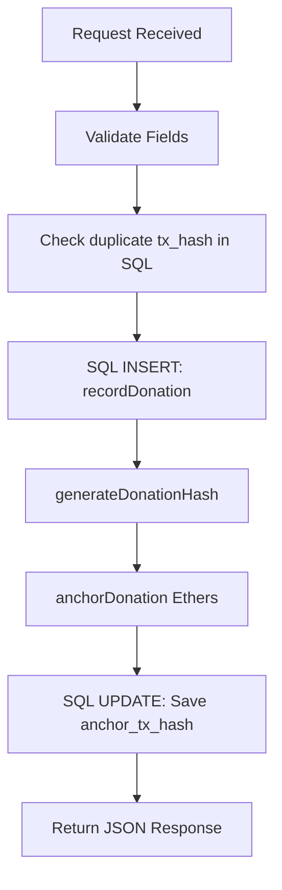

# CampusChain Donation Flow & Integration Deep-Dive
*Prepared by Senior Software Architect*

This manual provides a detailed analysis of the donation flows (Crypto and Razorpay) in the CampusChain project. All code snippets, file paths, and execution paths are derived directly from the codebase.

---

## PART 1 — SMART CONTRACTS

This section details the two smart contracts: [contract.sol](file:///d:/CampusChain/contract.sol) (`CampusChainCrowdfunding`) and [DonationProofRegistry.sol](file:///d:/CampusChain/DonationProofRegistry.sol) (`DonationProofRegistry`).

### 1. `CampusChainCrowdfunding` & the `donate()` Function

*   **Function Signature**:
    ```solidity
    function donate(uint256 _fundraiserId) external payable fundraiserExists(_fundraiserId)
    ```
*   **Parameters**: `_fundraiserId` (uint256) - The ID of the target fundraiser.
*   **`payable` Usage**: The `payable` modifier allows the function to receive Ether (`msg.value`) along with the transaction call.
*   **State Variables Modified**:
    *   `fundraisers[_fundraiserId].raised` (uint256): Incremented by `msg.value` (Line 119).
    *   `fundraisers[_fundraiserId].active` (bool): Set to `false` if `raised >= goal` (Line 136).
    *   `donations[_fundraiserId]` (mapping array): Appends a new `Donation` struct to the list (Line 121).
*   **Storage Layout**:
    *   `fundraisers` is located in slot 1. The data fields for a campaign are stored at:
        $$\text{SlotLocation} = \text{keccak256}(\text{abi.encode}(\text{\_fundraiserId}, 1))$$
    *   The `donations` mapping is located in slot 2. The array length is stored at:
        $$\text{LengthLocation} = \text{keccak256}(\text{abi.encode}(\text{\_fundraiserId}, 2))$$
        The elements of the array are stored sequentially starting at:
        $$\text{StartSlot} = \text{keccak256}(\text{LengthLocation})$$
*   **Mappings Used**:
    *   `fundraisers` (Line 36): Maps fundraiser IDs to campaigns.
    *   `donations` (Line 39): Maps fundraiser IDs to lists of donations.
*   **Arrays Used**:
    *   `donations[_fundraiserId]` (struct array): Appends a new `Donation` struct to the list.
*   **Events Emitted**:
    *   `DonationMade` (Line 132): `emit DonationMade(_fundraiserId, msg.sender, msg.value)`
    *   `FundraiserClosed` (Line 137): `emit FundraiserClosed(_fundraiserId)`
*   **Validation Checks**:
    *   `_id < fundraiserCount` (enforced by the `fundraiserExists` modifier on Line 60).
    *   `fundraiser.active` (asserts that the fundraiser is active, Line 116).
    *   `msg.value > 0` (asserts that the transaction contains Ether, Line 117).
*   **Ether Transfer Flow**:
    ```solidity
    fundraiser.owner.transfer(msg.value);
    ```
    Directly transfers the received Ether from the contract's balance to the campaign owner's address.
*   **Gas Considerations**:
    *   Uses a storage reference pointer (`Fundraiser storage fundraiser = fundraisers[_fundraiserId]`) to avoid copying the struct to memory, saving gas on reads and writes.
    *   Appending to the `Donation[]` array is a gas-heavy write operation ($SSTORE$ from zero to non-zero).
*   **Possible Failure Cases**:
    *   *Revert due to inactive fundraiser*: The fundraiser is closed or already reached its goal.
    *   *Revert due to transfer failure*: If the owner address is a contract that does not implement a `receive()` or `fallback()` function, or if the transfer runs out of gas, the transaction reverts.

---

### Other Functions in `CampusChainCrowdfunding`

#### `createFundraiser(string calldata _title, string calldata _description, uint256 _goal)`
*   **Execution**:
    *   Asserts `_goal > 0`.
    *   Writes a new `Fundraiser` struct to the `fundraisers` mapping at the current `fundraiserCount` index.
    *   Emits `FundraiserCreated`.
    *   Increments `fundraiserCount`.

#### `closeFundraiser(uint256 _fundraiserId)`
*   **Execution**:
    *   Asserts fundraiser exists and the caller is the owner (`onlyOwner`).
    *   Sets `active = false` and emits `FundraiserClosed`.

#### `getDonations(uint256 _fundraiserId)`
*   **Execution**:
    *   Returns the array of `Donation` structs stored in `donations[_fundraiserId]` from storage.

#### Modifiers
*   `fundraiserExists(uint256 _id)`: Verifies `_id < fundraiserCount`.
*   `onlyOwner(uint256 _id)`: Verifies `msg.sender == fundraisers[_id].owner`.

---

### 2. `DonationProofRegistry` Smart Contract

*   **Storage Variables**:
    *   `proofs` (mapping, Line 20): Maps `bytes32 => Proof`.
*   **Structs**:
    *   `Proof` (Line 14): Contains `uint256 timestamp` and `address anchoredBy`.
*   **Constructor**: None.
*   **`anchorDonation(bytes32 donationHash)`** (Line 32):
    *   Checks that the hash is non-zero.
    *   Checks that the hash has not been anchored before (`proofs[donationHash].timestamp == 0`).
    *   Writes a new `Proof` struct to the `proofs` mapping and emits the `DonationAnchored` event.
*   **`verifyDonation(bytes32 donationHash)`** (Line 61):
    *   Returns a boolean indicating if the hash exists in the `proofs` mapping (`proofs[donationHash].timestamp != 0`).
*   **`getProof(bytes32 donationHash)`** (Line 73):
    *   Returns the timestamp and anchoring address for a given hash, reverting if the proof is not found.
*   **Access Control**:
    *   **Inconsistency/Vulnerability**: There is no access control on `anchorDonation`. Anyone can call this function to anchor a hash.
*   **Why only hashes are stored**:
    *   Writing data to the blockchain is expensive. Storing a 32-byte hash is significantly cheaper than storing the full donation metadata, and still provides tamper-proof verification.

---

## PART 2 — CRYPTO DONATION FLOW

This section walks through the complete sequence of events for a cryptocurrency donation.

```text
Step 1: User clicks "Donate" (on fundraiser-detail.html)
  ↓
Step 2: Frontend triggers form listener and connects to MetaMask
  * File: [fundraiser-detail.js]
  * Function: `donateCrypto()` (Line 230)
  ↓
Step 3: Web3.js requests contract interaction from MetaMask
  * Snippet: `await contract.methods.donate(fundraiserId).send({ from: userAccount, value: ... })`
  ↓
Step 4: MetaMask opens confirm transaction modal for user
  ↓
Step 5: User signs transaction, broadcasting it to the Sepolia network
  ↓
Step 6: Smart contract processes transaction
  * File: [contract.sol]
  * Function: `donate()` (Line 109)
  * Logic: Verifies fundraiser status, transfers Ether, records donation, and emits events
  ↓
Step 7: Transaction is mined, returning a receipt with the transaction hash to the frontend
  ↓
Step 8: Frontend notifies the backend of the successful transaction
  * File: [fundraiser-detail.js] (Line 249)
  * Fetch call: `POST /api/donate`
  ↓
Step 9: Backend verifies parameters and checks for duplicate transactions
  * File: [donation.controller.js] (Line 7)
  * Function: `donate()`
  * Query: `SELECT donation_id FROM donations WHERE tx_hash = ?`
  ↓
Step 10: Backend records the donation in the database
  * File: [donation.service.js] (Line 6)
  * Function: `recordDonation()`
  * Query: `INSERT INTO donations (fundraiser_id, donor_address, amount, tx_hash, ...) VALUES (...)`
  ↓
Step 11: Backend generates the deterministic donation hash
  * File: [blockchain.service.js] (Line 92)
  * Function: `generateDonationHash()`
  ↓
Step 12: Backend anchors the donation hash on-chain using the registry contract
  * File: [blockchain.service.js] (Line 176)
  * Function: `anchorDonation()`
  * Smart Contract: `DonationProofRegistry.anchorDonation(donationHash)`
  ↓
Step 13: Receipt is returned, and backend updates the database with the anchoring hash
  * Query: `UPDATE donations SET anchor_tx_hash = ? WHERE donation_id = ?`
  ↓
Step 14: Backend returns a success response to the frontend
  * Response: `{ "message": "Donation successful", "donationId": ... }`
  ↓
Step 15: Frontend updates the UI to show success
```

---

## PART 3 — BACKEND DONATION CONTROLLER

The backend controller handles the logic for recording donations in the database and anchoring proofs on-chain.

### Execution Order

The execution sequence is: **SQL Query Duplicate Check** → **SQL Insert** → **Blockchain Anchoring (Ethers)** → **SQL Update**.



### Analysis of [donation.controller.js](file:///d:/CampusChain/backend/controllers/donation.controller.js#L7-L76)

1.  **Authentication**: Protected by `verifyToken` and `requireRole("donor")`. The authenticated donor's wallet address is read from `req.user.wallet`.
2.  **Input Validation**:
    *   Coerces variables: `fundraiser_id = parseInt(fundraiser_id)` and `amount = parseFloat(amount)`.
    *   Asserts fields are valid numbers: `if (isNaN(fundraiser_id) || isNaN(amount)) { throw new ExpressError(400, "Invalid donation data"); }`.
3.  **Duplicate Check (SQL Query)**:
    *   Queries the `donations` table to check if the transaction hash already exists:
        ```javascript
        const [existing] = await db.promise().query(
          "SELECT donation_id FROM donations WHERE tx_hash = ?",
          [tx_hash]
        );
        ```
4.  **SQL Insert**:
    *   Calls the `recordDonation` service to save the donation:
        ```javascript
        const { donationId, donatedAt } = await recordDonation({
          fundraiser_id,
          donor_address: donorWallet,
          amount,
          tx_hash,
          payment_method: "crypto",
          payment_reference: "",
          currency: "ETH",
        });
        ```
5.  **Hash Generation**:
    *   Generates the deterministic donation hash:
        ```javascript
        const donationHash = generateDonationHash({ donationId, fundraiser_id, donor_address: donorWallet, amount, payment_method: "crypto", payment_reference: "", donatedAt });
        ```
6.  **Blockchain Anchoring**:
    *   Sends a transaction to the smart contract:
        ```javascript
        const { anchorTxHash } = await anchorDonation(donationHash);
        ```
7.  **SQL Update**:
    *   Updates the donation record with the anchoring transaction hash:
        ```javascript
        await db.promise().query(
          "UPDATE donations SET anchor_tx_hash = ? WHERE donation_id = ?",
          [anchorTxHash, donationId]
        );
        ```

---

## PART 4 — HASH GENERATION

*   **Function Name**: `generateDonationHash` in [blockchain.service.js](file:///d:/CampusChain/backend/services/blockchain.service.js#L92).
*   **Exact Implementation**:
    ```javascript
    export const generateDonationHash = ({
      donationId,
      fundraiser_id,
      donor_address,
      amount,
      payment_method,
      payment_reference,
      donatedAt,
    }) => {
      let cleanDonorAddress = donor_address;
      if (!ethers.isAddress(cleanDonorAddress)) {
        cleanDonorAddress = ethers.ZeroAddress;
      }
      const tsSeconds = Math.floor(new Date(donatedAt).getTime() / 1000);
      const amountStr = String(amount);
      let amountEncoded;
      if (/^\d+$/.test(amountStr)) {
        amountEncoded = BigInt(amountStr);
      } else {
        amountEncoded = ethers.toBigInt(ethers.keccak256(ethers.toUtf8Bytes(amountStr)));
      }
      const paymentMethodStr = payment_method ?? "";
      const paymentRefStr = payment_reference ?? "";

      const encoded = ethers.AbiCoder.defaultAbiCoder().encode(
        [
          "uint256", // donation_id
          "uint256", // fundraiser_id
          "address", // donor_address
          "uint256", // amount
          "string",  // payment_method
          "string",  // payment_reference
          "uint256", // donated_at
        ],
        [
          BigInt(donationId),
          BigInt(fundraiser_id),
          cleanDonorAddress,
          amountEncoded,
          paymentMethodStr,
          paymentRefStr,
          BigInt(tsSeconds),
        ]
      );
      return ethers.keccak256(encoded);
    };
    ```
*   **Fields & Order in ABI Pack**:
    1.  `donationId` (uint256)
    2.  `fundraiser_id` (uint256)
    3.  `donor_address` (address)
    4.  `amount` (uint256 representation)
    5.  `payment_method` (string)
    6.  `payment_reference` (string)
    7.  `donated_at` (uint256 timestamp in seconds)
*   **Hashing Algorithm**: Keccak256.
*   **Encoding used**: Standard ABI encoding via Ethers' `AbiCoder.defaultAbiCoder().encode`.
*   **Field Selection Logic**: Captures the identity and financial details of the donation (Who sent the funds, to which campaign, how much was sent, when it was sent, and what payment reference was used). Mutating transaction fields (such as `tx_hash` or `anchor_tx_hash`) are omitted to ensure the hash can be verified identically off-chain.

---

## PART 5 — VERIFICATION FLOW

```text
User clicks Verify (donor-dashboard.html)
  ↓
Frontend fetches verify API: `GET /api/donation/:donationId/verify`
  ↓
Backend routes request to: `verifyDonationProof()` in [donationVerification.controller.js]
  ↓
Backend queries donation details from database:
  Query: `SELECT ... FROM donations WHERE donation_id = ? AND donor_address = ?`
  ↓
Backend recomputes the deterministic hash:
  Function: `generateDonationHash()` in [blockchain.service.js]
  ↓
Backend calls on-chain view function to check proof status:
  Function: `verifyDonation()` in [blockchain.service.js]
  Smart Contract: `DonationProofRegistry.verifyDonation(donationHash)`
  ↓
Ethers.js provider reads mapping status on Sepolia blockchain
  ↓
Backend returns verification status to the frontend
```

---

## PART 6 — RAZORPAY INTEGRATION FLOW

### Execution Sequence

```text
Step 1: User clicks "Donate" (Selects Razorpay option)
  ↓
Step 2: Frontend calls Backend API to initialize checkout order
  * Fetch call: `POST /api/razorpay/create-order`
  ↓
Step 3: Backend creates checkout order with Razorpay
  * File: [payment.controller.js]
  * Function: `createOrder()` (Line 165)
  * Razorpay API call: `razorpay.orders.create({ amount: Paise, ... })`
  ↓
Step 4: Backend returns order metadata to the frontend
  ↓
Step 5: Frontend opens Razorpay Checkout UI modal
  ↓
Step 6: User completes payment on Razorpay UI
  ↓
Step 7: Checkout returns payment parameters and signature to the frontend
  ↓
Step 8: Frontend calls Backend API to verify payment
  * Fetch call: `POST /api/razorpay/verify`
  ↓
Step 9: Backend verifies parameters and cryptographic signature
  * File: [payment.controller.js]
  * Function: `verifyPayment()` (Line 58)
  * Signature verification: HMAC-SHA256 comparison using `RAZORPAY_KEY_SECRET`
  ↓
Step 10: Backend checks for duplicate payment references
  * Query: `SELECT donation_id FROM donations WHERE payment_reference = ?`
  ↓
Step 11: Backend records the donation in the database
  * Function: `recordDonation()`
  * Query: `INSERT INTO donations (payment_method: 'razorpay', payment_reference: razorpay_payment_id, ...)`
  ↓
Step 12: Backend generates donation hash and anchors it on-chain
  * Smart Contract: `DonationProofRegistry.anchorDonation(donationHash)`
  ↓
Step 13: Backend updates the database record with the anchoring hash
  * Query: `UPDATE donations SET anchor_tx_hash = ? WHERE donation_id = ?`
  ↓
Step 14: Backend returns verification response to the frontend
```

### Cryptographic Signature Verification

*   **HMAC computation**: Computes the HMAC-SHA256 signature using the payment parameters and the `RAZORPAY_KEY_SECRET`:
    ```javascript
    const payload = `${razorpay_order_id}|${razorpay_payment_id}`;
    const expected = crypto.createHmac("sha256", secret).update(payload).digest("hex");
    ```
*   **Duplicate payment protection**: Checked by querying `SELECT donation_id FROM donations WHERE payment_reference = ?` in [payment.controller.js](file:///d:/CampusChain/backend/controllers/payment.controller.js#L103). If the payment reference exists, it returns a `409` conflict response.
*   **Webhooks**: *Not implemented in the current codebase.*

---

## PART 7 — SQL SCHEMA

### Table Schema: `donations`
*   `donation_id` (INT, Primary Key, Auto Increment): Unique identifier for the donation.
*   `fundraiser_id` (BIGINT, Foreign Key): References the associated fundraiser campaign.
*   `donor_address` (VARCHAR(42)): The wallet address of the donor. (Populated by MetaMask, or defaults to `ZeroAddress` for unregistered Razorpay users).
*   `amount` (DECIMAL(30,18)): The donation amount. (Stored in ETH for MetaMask, or INR for Razorpay).
*   `tx_hash` (VARCHAR(100)): Transaction hash. (Stores the MetaMask transaction hash, or a unique fallback hash based on the current timestamp for Razorpay orders).
*   `payment_method` (VARCHAR(50)): The payment method used. (Values: `'crypto'` or `'razorpay'`).
*   `payment_reference` (VARCHAR(200)): Payment gateway reference. (Stores the `razorpay_payment_id`, or remains empty for crypto).
*   `donated_at` (TIMESTAMP): The date and time of the donation.
*   `anchor_tx_hash` (VARCHAR(100)): The on-chain anchoring transaction hash. (Set to `NULL` initially, and updated after successful anchoring).
*   `currency` (VARCHAR(10)): The payment currency. (Values: `'ETH'` or `'INR'`).

---

## PART 8 — FAILURE SCENARIO MATRIX

| Failure Scenario | Database State | Blockchain State | System Behavior / Recovery |
| :--- | :--- | :--- | :--- |
| **MetaMask Rejects** | Empty | No Transaction | The web browser catches the rejection error. No database entries are written, and no smart contract methods are called. |
| **Contract Reverts** | Empty | Reverted / Void | The transaction is reverted on-chain. No database entries are written, and the UI displays a transaction failure warning. |
| **SQL Insert Fails** | Rolled back | Mined / Finalized | Inconsistent state. The user's ETH is transferred to the recipient, but the donation is not recorded in the database. Recovery requires manual database reconciliation. |
| **Registry Tx Fails** | Mined / Saved | Empty Registry | Inconsistent state. The donation is recorded in the database, but the hash is not anchored on-chain. The database row's `anchor_tx_hash` remains set to `NULL`. |
| **Razorpay Verify Fails** | Empty | No Transaction | The API returns a `401` unauthorized response. The donation is not recorded in the database, and the hash is not anchored on-chain. |
| **SQL succeeds but Registry fails** | Mined / Saved | Empty Registry | The donation record is kept in the database, but the on-chain proof is missing. The backend logs the failure but returns a success status to the client. |

---

## PART 9 — SMART CONTRACT EVENTS

### 1. `CampusChainCrowdfunding` Events

*   **`FundraiserCreated`**:
    *   *Parameters*: `fundraiserId` (uint256), `owner` (address), `title` (string), `goal` (uint256).
    *   *Trigger*: Emitted when `createFundraiser()` finishes writing data on-chain.
    *   *Usage*: Used by off-chain indexing services to track active campaigns.
*   **`DonationMade`**:
    *   *Parameters*: `fundraiserId` (uint256), `donor` (address), `amount` (uint256).
    *   *Trigger*: Emitted when a user sends ETH to a campaign via `donate()`.
    *   *Usage*: Used to update the campaign's total raised progress bar.
*   **`FundraiserClosed`**:
    *   *Parameters*: `fundraiserId` (uint256).
    *   *Trigger*: Emitted when the campaign owner calls `closeFundraiser()`, or when the fundraising goal is reached.

### 2. `DonationProofRegistry` Events

*   **`DonationAnchored`**:
    *   *Parameters*: `donationHash` (bytes32), `anchoredBy` (address), `timestamp` (uint256).
    *   *Trigger*: Emitted when `anchorDonation()` successfully anchors a donation hash.
    *   *Usage*: Emitted to provide cryptographic proof of anchoring.

---

## PART 10 — LIBRARIES & SYSTEM RESPONSIBILITIES

*   **Web3.js**:
    *   *Where:* Client-side codebase ([create-fundraiser.js](file:///d:/CampusChain/frontend/create-fundraiser.js#L38) and [fundraiser-detail.js](file:///d:/CampusChain/frontend/fundraiser-detail.js#L210)).
    *   *Responsibility:* Connects to MetaMask's provider (`window.ethereum`), parses contract ABIs, maps form fields, and signs transaction inputs.
*   **Ethers.js**:
    *   *Where:* Backend service ([blockchain.service.js](file:///d:/CampusChain/backend/services/blockchain.service.js)).
    *   *Responsibility:* Manages Sepolia JSON-RPC calls, encodes parameters, pays gas fees, and signs transactions.

---

## PART 11 — DETAILED SEQUENCE DIAGRAMS

### 1. Crypto Donation Flow
```text
User            Frontend UI           MetaMask Wallet       Crowdfunding Contract      Express API (EC2)        TiDB Database
 |                   |                       |                        |                         |                     |
 |--- Donate ETH --->|                       |                        |                         |                     |
 |                   |-- donate(id) -------->|                        |                         |                     |
 |                   |   send({value: ETH})  |                        |                         |                     |
 |                   |                       |-- send transaction --->|                         |                     |
 |                   |                       |   (Gas processed)      |                         |                     |
 |                   |                       |<-- Return tx receipt --+                         |                     |
 |                   |                       |                                                  |                     |
 |                   |-- POST /api/donate ----------------------------------------------------->|                     |
 |                   |   (Payload: fundraiser_id, amount, tx_hash)                              |                     |
 |                   |                                                                          |-- Check duplicate ->|
 |                   |                                                                          |-- INSERT Record --->|
 |                   |                                                                          |<-- Return Id (104) -|
 |                   |                                                                          |                     |
 |                   |                                                                          |-- anchorDonation() -|
 |                   |                                                                          |   (Registry call)   |
 |                   |                                                                          |-- UPDATE anchor --->|
 |                   |<-- Success JSON ---------------------------------------------------------|                     |
 |<-- Show Success --|                                                                                                |
```

### 2. Razorpay Donation Flow
```text
User            Frontend UI           Express API (EC2)        Razorpay Gateway        TiDB Database        Alchemy RPC Node
 |                   |                       |                        |                     |                      |
 |--- Donate INR --->|                       |                        |                     |                      |
 |                   |-- POST /create-order->|                        |                     |                      |
 |                   |                       |-- orders.create() ---->|                     |                      |
 |                   |                       |<-- Return order ID ----|                     |                      |
 |                   |<-- Return order ID ---|                        |                     |                      |
 |                   |                                                |                     |                      |
 |                   |-- Open Checkout UI --------------------------->|                     |                      |
 |                   |<-- Completes payment --------------------------|                     |                      |
 |                   |                                                                      |                      |
 |                   |-- POST /api/razorpay/verify ---------------------------------------->|                      |
 |                   |   (Payload: order_id, payment_id, signature)                         |                      |
 |                   |                                                                      |-- Verify signature --|
 |                   |                                                                      |-- Check duplicate ->|
 |                   |                                                                      |-- INSERT Record --->|
 |                   |                                                                      |<-- Return Id (105) -|
 |                   |                                                                      |                      |
 |                   |                                                                      |-- anchorDonation() ->|
 |                   |                                                                      |-- UPDATE anchor --->|
 |                   |<-- Verification Success JSON ----------------------------------------|                      |
 |<-- Show Success --|                                                                                             |
```

---

## PART 12 — INTERVIEW QUESTION COMPENDIUM

This section lists interview questions and answers derived directly from the CampusChain implementation.

### Beginner Level Questions (1–30)

#### Q1: Which library is used to interact with smart contracts on the frontend, and which is used on the backend?
*   *Answer:* The frontend uses **Web3.js** inside [create-fundraiser.js](file:///d:/CampusChain/frontend/create-fundraiser.js#L38) to interact with MetaMask, while the backend uses **Ethers.js** inside [blockchain.service.js](file:///d:/CampusChain/backend/services/blockchain.service.js#L1) to execute transactions.

#### Q2: What is the purpose of the `pay_` reference prefix checked inside the Razorpay verify function?
*   *Answer:* The payment reference string `pay_...` is Razorpay's unique identifier for successful payments. It is checked inside [payment.controller.js](file:///d:/CampusChain/backend/controllers/payment.controller.js#L103) to prevent duplicate transaction entries.

#### Q3: Which backend endpoint is used to check if the database connection pool is active?
*   *Answer:* The `/test-db` endpoint, defined inside [app.js](file:///d:/CampusChain/backend/app.js#L64). It runs a test database query (`SELECT 1`) to check the database pool status.

#### Q4: Why does the backend generate the donation timestamp instead of using the time provided by the client?
*   *Answer:* Generating the timestamp on the backend ensures consistency between the timestamp stored in the database and the timestamp used to generate the on-chain donation proof hash.

#### Q5: What database error code is intercepted during user signup to detect email collisions?
*   *Answer:* The code `ER_DUP_ENTRY` is caught inside [auth.controller.js](file:///d:/CampusChain/backend/controllers/auth.controller.js#L50).

#### Q6: How does the application prevent duplicate MetaMask donation submissions?
*   *Answer:* Checks for existing records matching the client's `tx_hash` inside [donation.controller.js](file:///d:/CampusChain/backend/controllers/donation.controller.js#L23).

#### Q7: What currency identifiers are supported by the `donations` table?
*   *Answer:* Supported currencies are `'ETH'` and `'INR'`, defined in [DATABASE.md](file:///d:/CampusChain/docs/DATABASE.md#L97).

#### Q8: Does the database store the campaign's transaction hash?
*   *Answer:* No. The `fundraisers` table only stores metadata and does not record the transaction hash of the campaign's creation.

#### Q9: What happens if you try to verify a donation hash that is not anchored on-chain?
*   *Answer:* The read-only view call to `verifyDonation` in [blockchain.service.js](file:///d:/CampusChain/backend/services/blockchain.service.js#L159) returns `false`, and the verify API returns `{ verified: false }`.

#### Q10: What is the cost factor (salt rounds) used for Bcrypt hashing?
*   *Answer:* The password hashing function uses 10 salt rounds inside [auth.controller.js](file:///d:/CampusChain/backend/controllers/auth.controller.js#L19).

#### Q11: How is the database SSL validation configured?
*   *Answer:* It is configured with `rejectUnauthorized: false` in [db/index.js](file:///d:/CampusChain/backend/db/index.js#L23) to allow secure SSL connections without requiring strict certificate authority validation.

#### Q12: Which SQL query aggregates the total funds raised for all campaigns?
*   *Answer:* The aggregated query inside `getAllFundraisers` in [fundraiser.controller.js](file:///d:/CampusChain/backend/controllers/fundraiser.controller.js#L11).

#### Q13: What happens to a fundraiser campaign on-chain once its goal is reached?
*   *Answer:* The crowdfunding contract's `donate` function automatically sets the campaign's `active` state to `false` (Line 136).

#### Q14: Which parameters does the smart contract's `onlyOwner` modifier inspect?
*   *Answer:* Compares the transaction sender (`msg.sender`) with the campaign owner (`fundraisers[_id].owner`).

#### Q15: Why is `Math.round()` used during Razorpay order creation?
*   *Answer:* Razorpay expects order amounts in the smallest currency unit (paise). `Math.round(amount * 100)` is used to convert decimal amounts to integers and prevent floating-point errors.

#### Q16: Where does the backend look for the JWT during authentication checks?
*   *Answer:* Looks for the token in the `Authorization` header inside [auth.middleware.js](file:///d:/CampusChain/backend/middlewares/auth.middleware.js#L11).

#### Q17: What details does the JWT payload contain?
*   *Answer:* Contains `{ id, role, wallet }` inside [auth.controller.js](file:///d:/CampusChain/backend/controllers/auth.controller.js#L82).

#### Q18: What is the default port used by the Express backend?
*   *Answer:* Port `5000`, defined inside [server.js](file:///d:/CampusChain/backend/server.js#L12).

#### Q19: Which database engine is used to host the relational database?
*   *Answer:* TiDB Cloud Serverless, a MySQL-compatible distributed database.

#### Q20: How are dynamic inputs validated inside `createFundraiser` in [fundraiser.controller.js]?
*   *Answer:* Checks for the presence of the `title` and `goal` fields in the request body.

#### Q21: What Solidity data types are used to represent campaign goals in the smart contract?
*   *Answer:* Represented as `uint256` values in Wei units.

#### Q22: What happens if a user submits a donation request to a closed campaign on the backend?
*   *Answer:* The database still inserts the record because the backend doesn't check the campaign's active status before saving the donation.

#### Q23: Which middleware handles JSON parsing?
*   *Answer:* The global `express.json()` middleware, defined in [app.js](file:///d:/CampusChain/backend/app.js#L42).

#### Q24: What database library is used to query the database?
*   *Answer:* The `mysql2` promise-wrapper pool library.

#### Q25: How does the application verify the sender's wallet address during profile updates?
*   *Answer:* Updates are routed to the user's authenticated ID (`req.user.id`), preventing users from updating profiles of other users.

#### Q26: What fallback value is used for the database user password?
*   *Answer:* Loaded from the environment variable `DB_PASS`.

#### Q27: How are static assets served by the backend?
*   *Answer:* Configured to serve static assets from the `../frontend` directory in [app.js](file:///d:/CampusChain/backend/app.js#L51).

#### Q28: How does the application prevent cross-role profile editing?
*   *Answer:* The profile update function checks the authenticated user's role (`req.user.role`) and routes updates to the corresponding details table.

#### Q29: What happens if a smart contract call is made without connecting MetaMask first?
*   *Answer:* The transaction fails immediately on the client side, showing an alert to connect the wallet.

#### Q30: Why does the smart contract use `calldata` for strings in `createFundraiser()`?
*   *Answer:* Using `calldata` avoids copying parameters to memory, saving execution gas.

---

### Intermediate Level Questions (31–60)

#### Q31: If Nginx handles Let's Encrypt certificates, how does Express process HTTPS requests?
*   *Answer:* Nginx acts as a reverse proxy, terminating SSL connections and forwarding traffic to Express on port 5000 as standard, unencrypted HTTP traffic.

#### Q32: Explain the execution risk of throwing errors inside the async `jwt.verify` callback function.
*   *Answer:* Throwing errors inside an asynchronous callback runs outside the Express middleware promise chain. Express's error-handling middleware cannot catch this exception, resulting in an unhandled exception that crashes the server process.

#### Q33: How does the connection pool manage database queries under sudden, high load spikes? What is the role of `queueLimit`?
*   *Answer:* The pool is configured with `connectionLimit: 10`. When all 10 connections are active, subsequent queries are placed in an internal queue. Since `queueLimit` is set to `0` (unlimited), queries will queue indefinitely, which can consume memory and cause request timeouts under high load.

#### Q34: What is the difference between client-side connection pooling and server-side pooling?
*   *Answer:* Client-side connection pooling maintains a pool of open connections inside the application process, while server-side pooling uses an external proxy (like pgBouncer) to manage connections across multiple application instances.

#### Q35: How does the backend prevent double-click submissions for Razorpay payments?
*   *Answer:* Checks for duplicate payment references in the database. If a matching `payment_reference` is found, the API returns a `409` conflict response.

#### Q36: Why does the backend generate a mock response for the blockchain service if configuration keys are missing?
*   *Answer:* This fallback mechanism allows the backend to start and run in local development environments without requiring a live Sepolia RPC connection.

#### Q37: What is the risk of using `rejectUnauthorized: false` for database connections in production?
*   *Answer:* Bypasses certificate authority validation, leaving the connection vulnerable to man-in-the-middle (MITM) attacks.

#### Q38: How does the `wrapAsync` helper ensure that errors are passed to the global error middleware?
*   *Answer:* Wraps route handlers in a wrapper function that catches rejected promises and forwards the error to `next()`.

#### Q39: Why does the frontend calculate progress metrics instead of relying on calculations returned from the API?
*   *Answer:* The frontend calculates progress percentages dynamically in the browser to avoid server overhead and ensure smooth rendering.

#### Q40: What happens to on-chain funds if the smart contract owner changes their address?
*   *Answer:* The crowdfunding contract transfers ETH directly to the campaign owner's address. Changing the owner's address in the database does not update the address stored in the smart contract on-chain.

#### Q41: Explain how the static exchange rate calculations inside SQL queries impact calculations under volatile market conditions.
*   *Answer:* Hardcoding static exchange rates inside SQL queries means calculations will be inaccurate unless the code is updated and redeployed.

#### Q42: What is the storage layout impact of adding a dynamic array getter like `getDonations` inside the smart contract?
*   *Answer:* Returning dynamic arrays in view calls does not cost gas. However, writing to arrays dynamically in write calls increases gas consumption as the array grows.

#### Q43: How does `db.promise().query()` prevent SQL injection attacks?
*   *Answer:* Prepares the query template first and treats variables strictly as parameters, preventing inputs from being executed as SQL code.

#### Q44: What happens if the backend signer wallet (`ANCHOR_PRIVATE_KEY`) runs out of Ether on Sepolia?
*   *Answer:* The backend cannot pay the gas fees required to anchor donation hashes, causing the `anchorDonation` service to fail and preventing new proofs from being registered.

#### Q45: How does the client sign and authorize MetaMask transactions?
*   *Answer:* Uses Web3.js to prompt the user to sign the transaction using their private key, which is handled securely by the MetaMask browser extension.

#### Q46: Why is `crypto.createHmac()` preferred over standard hashing for signature verification?
*   *Answer:* HMAC uses a secret key alongside the hash function, preventing length extension attacks and ensuring that signatures can only be generated by parties with access to the secret.

#### Q47: What is the difference between a load balancer liveness probe and a liveness endpoint check?
*   *Answer:* A liveness probe checks if the container process is running, while a health check endpoint verifies that downstream dependencies (like the database) are accessible.

#### Q48: How does the database manage transactions when registering a user with role-specific details?
*   *Answer:* The application currently executes two independent queries without a transaction block, leaving the system vulnerable to orphan user records if the second insert fails.

#### Q49: Why does the smart contract cast the owner's address to a `payable` address?
*   *Answer:* Casts the address to a payable address to authorize the smart contract to send Ether directly to it.

#### Q50: How does the database schema enforce integrity constraints when deleting fundraisers?
*   *Answer:* Deleting a fundraiser is handled in the database, but comment and donation records remain in the database unless cascade delete constraints are explicitly configured.

---

### Advanced System Design Questions (61–90)

#### Q61: Under high concurrent load, how would you prevent race conditions when two users try to donate to the same fundraiser at the same time?
*   *Answer:* Use database transactions with pessimistic locking (`SELECT ... FOR UPDATE`) on the target fundraiser row to block concurrent updates until the first transaction completes, or handle updates on-chain using smart contract states.

#### Q62: Describe the security implications of not having access control on the `anchorDonation` function in the registry contract.
*   *Answer:* Anyone can call the function to anchor arbitrary hashes to the registry. While this does not compromise existing proofs, it allows attackers to pollute the contract events log. To secure it, restrict access to the backend's signer wallet.

#### Q63: How would you modify the donation flow to handle temporary blockchain RPC network drops without losing donation proofs?
*   *Answer:* Implement an asynchronous message queue (e.g., BullMQ backed by Redis). Save the donation record in the database immediately, queue a job to anchor the proof on-chain, and let worker instances retry the anchoring process until it succeeds.

#### Q64: How does the distributed database architecture of TiDB Cloud handle ACID guarantees under load?
*   *Answer:* TiDB uses a distributed transaction model based on the Percolator protocol, separating storage from compute nodes and achieving consensus via the Raft algorithm to ensure consistency across nodes.

#### Q65: What is the maximum throughput limit of your Sepolia anchoring setup? How does the block mining latency impact this?
*   *Answer:* The backend signer account can only send one transaction per block nonce sequence. Block times on Sepolia (around 12 seconds) limit the anchoring throughput to one transaction per block, creating a performance bottleneck under high load.

#### Q66: Explain how you would scale the Express backend to 100k requests/second using stateless instances.
*   *Answer:* Run multiple Express instances behind a load balancer, store user sessions on the client using stateless JWTs, and implement a Redis cache to serve read-heavy endpoints.

#### Q67: How would you prevent replay attacks on Razorpay payment signatures?
*   *Answer:* Track payment IDs in the database and reject incoming signatures that match previously processed payment references.

#### Q68: What is the difference between optimistic locking and pessimistic locking, and which would you use for updating campaign balances?
*   *Answer:* Optimistic locking uses a version column to check for concurrent updates before writing, while pessimistic locking locks the target database row during the transaction. Pessimistic locking is preferred for financial updates to prevent race conditions.

#### Q69: If the user's browser crashes after they authorize a MetaMask payment, how would you reconcile the state of the database?
*   *Answer:* Set up an offline indexing script that listens for the contract's `DonationMade` event on the blockchain and updates the database with missing records.

#### Q70: How would you implement a retry mechanism for failed blockchain anchoring transactions?
*   *Answer:* Use an asynchronous job queue (like BullMQ) that automatically retries failed tasks with exponential backoff.

#### Q71: Explain the security risks of loading the backend's private key (`ANCHOR_PRIVATE_KEY`) directly into the environment variables.
*   *Answer:* Storing keys in configuration files exposes them to unauthorized access. In production, keys should be stored in a secure key management system (like AWS Secrets Manager or HashiCorp Vault).

#### Q72: How would you handle real-time exchange rates in the database queries instead of using static multipliers?
*   *Answer:* Create an exchange rate table in the database that is updated periodically by a background task querying a financial exchange API.

#### Q73: What is the gas cost difference between storing raw strings on-chain vs. storing a 32-byte hash?
*   *Answer:* Storing a 32-byte hash uses a single storage slot ($SSTORE$ costing 20,000 gas units), while storing a raw string requires multiple slots and dynamic allocations, which can consume hundreds of thousands of gas units.

#### Q74: How would you design a webhook-based verification flow for Razorpay payments?
*   *Answer:* Expose a public endpoint (`POST /api/razorpay/webhook`) that verifies the signature of incoming events and processes transactions asynchronously.

#### Q75: How does the V8 engine allocate memory when compiling and executing Express router paths?
*   *Answer:* V8 parses Javascript code into an Abstract Syntax Tree (AST), compiles it to machine code, and allocates router configurations and closures on the heap.

#### Q76: Explain the difference between horizontal scaling and vertical scaling for the backend server and database.
*   *Answer:* Horizontal scaling adds more instances of the server or database (e.g. read replicas), while vertical scaling adds more CPU or memory to the existing host.

#### Q77: How would you implement rate limiting on the `/signup` and `/login` endpoints to prevent brute-force attacks?
*   *Answer:* Implement rate-limiting middleware (like `express-rate-limit`) backed by a Redis store to track and limit requests by client IP address.

#### Q78: Explain the security implications of using JWTs without an expiration time.
*   *Answer:* Non-expiring tokens can be used indefinitely if compromised. Implementing a reasonable expiration time limits the window of opportunity for attackers.

#### Q79: What is the difference between symmetric encryption and asymmetric encryption, and where is each used in this system?
*   *Answer:* Symmetric encryption uses a shared key to encrypt and decrypt data (like verifying signatures using the Razorpay secret), while asymmetric encryption uses a public/private key pair (like signing blockchain transactions).

#### Q80: How would you optimize SQL search performance as the campaign database grows?
*   *Answer:* Create database indexes on search-heavy columns (like `title` and `category`) to speed up query execution.

#### Q81: What is the difference between a process manager (like PM2) and a container orchestrator (like Kubernetes)?
*   *Answer:* PM2 manages Node.js processes on a single host, while Kubernetes orchestrates container deployments across a cluster of multiple physical or virtual hosts.

#### Q82: How would you handle database schema migrations in production without causing downtime?
*   *Answer:* Use a schema migration tool (like Knex or db-migrate) to apply changes incrementally, ensuring backward compatibility with the active application code.

#### Q83: Explain the role of the V8 garbage collector in preventing memory leaks inside connection pools.
*   *Answer:* The garbage collector releases memory allocated to unused references. If connection pool instances are not closed or released properly, they remain referenced and cannot be garbage collected, causing memory leaks.

#### Q84: How would you implement a watchlist feature that syncs across multiple devices?
*   *Answer:* Create a `watchlist` table in the database and expose endpoints to add, remove, and retrieve bookmarked campaigns.

#### Q85: What is the impact of using `cors()` without options in production?
*   *Answer:* Using `cors()` without options allows any domain to request resources from your backend, leaving the API vulnerable to unauthorized cross-site requests.

#### Q86: How would you design a distributed cache system for campaign listings?
*   *Answer:* Set up a Redis cluster and implement a cache-aside pattern on read-heavy endpoints, invalidating or updating the cache when campaigns are updated.

#### Q87: What is the difference between standard ABI encoding and tightly packed ABI encoding in Solidity?
*   *Answer:* Standard ABI encoding pads parameters to 32-byte boundaries, while tightly packed encoding (`abi.encodePacked`) encodes values without padding, saving gas but increasing the risk of hashing collisions.

#### Q88: How would you handle blockchain transaction underpricing errors?
*   *Answer:* Implement gas pricing estimation in the blockchain service and automatically resubmit failed transactions with a higher gas price.

#### Q89: What is the difference between read replicas and database shards?
*   *Answer:* Read replicas duplicate data to offload read queries, while database shards partition data horizontally across multiple database nodes to distribute write load.

#### Q90: How would you handle real-time notifications for new donations?
*   *Answer:* Implement a WebSocket server (using libraries like `ws` or Socket.io) to push real-time updates to connected clients when new donations are recorded.
